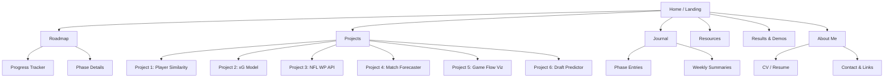

# 100 Days of Data & Sports Challenge
## ML Engineer | Data Scientist — Sports Analytics Specialization

---

# SECCIÓN 1: Visión General del Programa

En 100 días construirás un perfil profesional diferenciado como **ML Engineer / Data Scientist especializado en Sports Analytics**, con 6 proyectos end-to-end desplegados, una página-portafolio en GitHub Pages con tracker de progreso, y un corpus de evidencia técnica (notebooks, pipelines, dashboards, APIs, posts técnicos) que demuestre dominio real sobre problemas de fútbol y football americano. No se trata de completar tutoriales: cada día produce un artefacto concreto que se integra en un portafolio cohesivo y profesional, listo para entrevistas, LinkedIn y procesos de hiring en clubes, ligas, casas de apuestas, medios deportivos y consultoras analíticas.

**¿Por qué este roadmap funciona?** Porque replica el flujo de trabajo real de un analista deportivo profesional: adquisición y limpieza de datos crudos, feature engineering con dominio de negocio, modelado con validación temporal estricta, storytelling ejecutivo, y despliegue de productos de datos consumibles. Al final de los 100 días no tendrás "ejercicios terminados" — tendrás **productos de datos** que resuelven problemas reales que equipos y organizaciones deportivas enfrentan hoy.

**Perfil profesional final:** ML Engineer / Data Scientist con especialización en Sports Analytics, capaz de (1) diseñar pipelines de datos deportivos end-to-end, (2) construir modelos predictivos con validación temporal rigurosa, (3) comunicar insights a stakeholders técnicos y no-técnicos, (4) desplegar productos de ML ligeros, y (5) demostrar todo lo anterior con evidencia pública y reproducible.

---

# SECCIÓN 2: Arquitectura del Roadmap

## Fase 1: Foundations & Infrastructure (Días 1–15)

**Objetivo:** Establecer la infraestructura técnica del portafolio, dominar las fuentes de datos deportivos clave, y construir pipelines de ingestión robustos para fútbol y football americano.

**Duración:** 15 días

**Skills:**
- Arquitectura de repos reproducibles
- Web scraping ético y uso de APIs deportivas
- Data wrangling con datos deportivos reales
- GitHub Pages setup profesional
- Diseño de schemas de datos deportivos

**Entregables:**
- Repositorio con estructura profesional completa
- GitHub Pages site con landing, tracker y about me
- 3 pipelines de ingestión de datos (StatsBomb, nflfastR, FBref)
- Datasets limpios y documentados listos para análisis
- README profesional del proyecto principal

**¿Por qué importa?** El 80% de los candidatos a roles de sports analytics fallan en la infraestructura: repos desordenados, datos no reproducibles, sin documentación. Esta fase te pone por delante desde el día 1.

---

## Fase 2: EDA & Feature Engineering Deportivo (Días 16–35)

**Objetivo:** Desarrollar fluencia en análisis exploratorio con dominio deportivo, construir feature stores especializados, y producir visualizaciones de calidad publicable.

**Duración:** 20 días

**Skills:**
- EDA con contexto de negocio deportivo
- Feature engineering avanzado (métricas por-90, métricas compuestas, rolling stats)
- Visualización deportiva (pitch plots, heatmaps, shot maps, field maps)
- Storytelling con datos deportivos
- Análisis de tracking data

**Entregables:**
- Notebooks de EDA completos para fútbol y football americano
- Feature store documentado con 50+ features engineered
- Galería de visualizaciones deportivas profesionales
- 2 posts técnicos tipo blog sobre insights encontrados
- Primer proyecto de portafolio: Player Similarity Engine

**¿Por qué importa?** Feature engineering deportivo ES el diferenciador. Cualquiera puede entrenar un XGBoost; pocos saben construir features como xG chain value, EPA per play adjusted, o pressing intensity indexes.

---

## Fase 3: Modelado Predictivo & Validación (Días 36–60)

**Objetivo:** Construir modelos predictivos rigurosos para problemas deportivos reales, con validación temporal, calibración y interpretabilidad.

**Duración:** 25 días

**Skills:**
- Modelos de clasificación y regresión aplicados a deportes
- Validación temporal (no random split — esto es crítico en deportes)
- Calibración de probabilidades
- Interpretabilidad (SHAP, feature importance contextualizada)
- Modelos de Expected Goals (xG) y Expected Points Added (EPA)
- Win probability models
- Bayesian approaches para small samples

**Entregables:**
- Modelo de xG propio entrenado y evaluado
- Modelo de win probability para NFL
- Pipeline de entrenamiento reproducible con MLflow/Weights & Biases
- Reportes de evaluación con métricas deportivas relevantes
- Segundo y tercer proyecto de portafolio

**¿Por qué importa?** El modelado con validación temporal es lo que separa a un data scientist serio de alguien que sobreajusta datos históricos. Los equipos profesionales valoran esto enormemente.

---

## Fase 4: Proyectos End-to-End & Productos de Datos (Días 61–85)

**Objetivo:** Integrar todo lo aprendido en proyectos completos que simulen entregas reales de un analista deportivo profesional: desde pregunta de negocio hasta producto consumible.

**Duración:** 25 días

**Skills:**
- Diseño de productos de datos deportivos
- APIs con FastAPI
- Dashboards interactivos con Streamlit/Panel
- Automatización de pipelines
- MLOps ligero (scheduling, monitoring básico)
- Comunicación ejecutiva de resultados

**Entregables:**
- Dashboard interactivo de scouting de jugadores
- API de predicción deportiva desplegada
- Sistema de ranking/rating con actualización automática
- Cuarto, quinto y sexto proyecto de portafolio
- Documentación técnica completa

**¿Por qué importa?** Las organizaciones deportivas no quieren notebooks — quieren productos. Un dashboard de scouting o una API de predicción son exactamente lo que un hiring manager quiere ver.

---

## Fase 5: Portfolio Polish, Branding & Interview Prep (Días 86–100)

**Objetivo:** Pulir todos los entregables, completar el sitio web, preparar narrativa profesional y optimizar presencia online para oportunidades reales.

**Duración:** 15 días

**Skills:**
- Technical writing
- Portfolio curation
- Personal branding para sports analytics
- Preparación de entrevistas técnicas
- Storytelling ejecutivo
- Networking estratégico

**Entregables:**
- Sitio web completo con todos los proyectos
- 6 READMEs de calidad profesional
- CV actualizado con sección de sports analytics
- 3 posts de LinkedIn con insights técnicos
- Documento de preparación para entrevistas
- Video walkthrough de un proyecto (opcional pero recomendado)

**¿Por qué importa?** Sin packaging profesional, el mejor modelo del mundo se queda en un notebook privado. Esta fase convierte tu trabajo técnico en capital profesional visible.

---

# SECCIÓN 3: Plan Detallado Día por Día

## FASE 1: Foundations & Infrastructure (Días 1–15)

---

### Día 1
- **Objetivo:** Arquitectura del repositorio mono-repo profesional
- **Duración:** 60 min
- **Tarea:** Crear estructura completa del repo: `data/raw/`, `data/processed/`, `notebooks/`, `src/`, `models/`, `reports/`, `docs/`, `web/`. Configurar `.gitignore` para datos pesados, crear `pyproject.toml` con dependencias, escribir `Makefile` con targets `setup`, `data`, `train`, `test`. Inicializar `environment.yml`.
- **Entregable:** Repo con estructura profesional, README esqueleto, Makefile funcional, primer commit con convención.
- **Skill:** Arquitectura de proyectos ML reproducibles
- **Portfolio:** La base de TODO. Un repo bien estructurado es la primera impresión.

### Día 2
- **Objetivo:** Setup de GitHub Pages con Jekyll/Hugo mínimo
- **Duración:** 60 min
- **Tarea:** Configurar GitHub Pages con tema profesional (recomendado: Jekyll `minimal-mistakes` o `al-folio`). Crear landing page con título del challenge, about me orientado a sports analytics, y estructura de navegación: Home, Roadmap, Projects, Journal, Resources, About.
- **Entregable:** Sitio web live en `username.github.io/100-days-Data-Sports-Challenge` con landing funcional.
- **Skill:** Despliegue web estático, branding profesional
- **Portfolio:** Tu escaparate público. Desde hoy existe y es visible.

### Día 3
- **Objetivo:** Diseñar tracker de progreso interactivo en la web
- **Duración:** 45 min
- **Tarea:** Implementar en la página web un tracker de los 100 días: tabla o grid con estado (pendiente/en-progreso/completado), enlace al entregable, y barra de progreso general. Puede ser una tabla Markdown auto-generada o un componente HTML/JS ligero.
- **Entregable:** Página `/roadmap` con tracker visual de 100 días, actualizable.
- **Skill:** Frontend básico, diseño de trackers
- **Portfolio:** Evidencia visual de disciplina y consistencia.

### Día 4
- **Objetivo:** Dominar StatsBomb Open Data (fútbol)
- **Duración:** 60 min
- **Tarea:** Instalar `statsbombpy`. Explorar la estructura de datos: competiciones, partidos, eventos, lineups. Extraer datos de la Champions League y La Liga. Documentar schema de datos en un notebook con descripción de cada campo relevante. Guardar datasets crudos en `data/raw/statsbomb/`.
- **Entregable:** Notebook `01_statsbomb_exploration.ipynb` con schema documentado + datasets descargados.
- **Skill:** Ingestión de datos deportivos, StatsBomb API
- **Portfolio:** Demuestra dominio de la fuente de datos más respetada en football analytics.

### Día 5
- **Objetivo:** Dominar nflfastR / nflverse (football americano)
- **Duración:** 60 min
- **Tarea:** Instalar `nfl_data_py` (wrapper Python de nflverse). Explorar play-by-play data, roster data, y schedule data. Documentar campos clave: EPA, WPA, CPOE, air yards, etc. Descargar temporadas 2020–2025. Guardar en `data/raw/nfl/`.
- **Entregable:** Notebook `02_nfl_data_exploration.ipynb` con schema documentado + datasets descargados.
- **Skill:** Datos NFL, comprensión de métricas avanzadas de football americano
- **Portfolio:** Acceso directo a datos NFL de calidad profesional.

### Día 6
- **Objetivo:** Scraping de FBref para datos complementarios de fútbol
- **Duración:** 60 min
- **Tarea:** Construir scraper con `requests` + `BeautifulSoup` para extraer tablas de estadísticas de jugador de FBref (top 5 ligas). Implementar rate limiting responsable, parseo de tablas con `pandas.read_html`, y almacenamiento estructurado. Documentar limitaciones y ética del scraping.
- **Entregable:** Script `src/scrapers/fbref_scraper.py` + notebook de demo + datos descargados.
- **Skill:** Web scraping ético, data engineering
- **Portfolio:** Demuestra capacidad de obtener datos cuando no hay API disponible.

### Día 7
- **Objetivo:** Construir pipeline de ingestión unificado
- **Duración:** 60 min
- **Tarea:** Crear módulo `src/data/loaders.py` con funciones: `load_statsbomb(competition, season)`, `load_nfl(seasons, data_type)`, `load_fbref(league, season, stat_type)`. Agregar logging, manejo de errores, caching local. Escribir tests unitarios mínimos.
- **Entregable:** Módulo de carga de datos reutilizable + tests + documentación de uso.
- **Skill:** Data engineering, modularización, testing
- **Portfolio:** Código de producción, no notebooks sueltos.

### Día 8
- **Objetivo:** Data quality checks para datos de fútbol
- **Duración:** 45 min
- **Tarea:** Implementar pipeline de calidad de datos para StatsBomb: nulls por campo, distribuciones de variables clave (xG, distancia de tiro, posición), detección de duplicados, validación de integridad referencial (match_id ↔ events). Generar reporte HTML automático con `ydata-profiling`.
- **Entregable:** Notebook `03_data_quality_football.ipynb` + reporte HTML de profiling.
- **Skill:** Data quality, profiling automatizado
- **Portfolio:** Rigor profesional desde la ingestión.

### Día 9
- **Objetivo:** Data quality checks para datos de NFL
- **Duración:** 45 min
- **Tarea:** Mismo ejercicio que día 8 pero para NFL play-by-play: validar EPA, WPA, CPOE; revisar distribuciones por tipo de jugada (pass/rush/punt/kickoff); detectar datos faltantes por temporada; verificar consistencia de game_id y drive sequences.
- **Entregable:** Notebook `04_data_quality_nfl.ipynb` + reporte HTML.
- **Skill:** Data quality aplicada a football americano
- **Portfolio:** Rigor consistente entre dominios deportivos.

### Día 10
- **Objetivo:** Construir esquema de datos estrella para fútbol
- **Duración:** 45 min
- **Tarea:** Diseñar schema dimensional: tabla de hechos (eventos/acciones), dimensiones (jugadores, equipos, partidos, competiciones, temporadas). Documentar con diagrama ERD en Mermaid. Implementar transformación de datos crudos a schema limpio con pandas.
- **Entregable:** Diagrama ERD en docs + script de transformación + datos procesados en `data/processed/football/`.
- **Skill:** Data modeling, diseño dimensional
- **Portfolio:** Pensamiento de data engineer, no solo de analyst.

### Día 11
- **Objetivo:** Construir esquema de datos estrella para NFL
- **Duración:** 45 min
- **Tarea:** Diseñar schema para NFL: hechos (plays), dimensiones (games, teams, players, drives, seasons). Normalizar play-by-play en tablas limpias. Documentar con ERD.
- **Entregable:** Diagrama ERD + script de transformación + datos procesados en `data/processed/nfl/`.
- **Skill:** Data modeling para football americano
- **Portfolio:** Consistencia arquitectónica entre proyectos.

### Día 12
- **Objetivo:** Introducción a tracking data y datos espaciales en fútbol
- **Duración:** 60 min
- **Tarea:** Explorar Metrica Sports open tracking data. Entender estructura: frames, posiciones x/y, ball tracking. Crear visualización básica de posiciones de jugadores en un frame. Calcular velocidad y distancia recorrida para un jugador en un partido.
- **Entregable:** Notebook `05_tracking_data_intro.ipynb` con visualizaciones de posiciones + métricas cinemáticas.
- **Skill:** Tracking data, datos espaciales, física aplicada
- **Portfolio:** Tracking data es el frontier de football analytics. Demostrarlo es diferenciador enorme.

### Día 13
- **Objetivo:** Crear librería de visualización deportiva propia
- **Duración:** 60 min
- **Tarea:** Construir módulo `src/viz/pitch.py` con funciones: `draw_pitch()`, `plot_shots()`, `plot_passes()`, `plot_heatmap()`. Para NFL: `src/viz/field.py` con `draw_field()`, `plot_play()`. Usar `mplsoccer` como referencia pero crear funciones propias reutilizables con estilo visual consistente.
- **Entregable:** Módulo de visualización con 6+ funciones + notebook demo con galería de visualizaciones.
- **Skill:** Visualización deportiva, matplotlib avanzado, design system
- **Portfolio:** Visualizaciones propias con estilo consistente = marca personal técnica.

### Día 14
- **Objetivo:** Documentar y publicar fase 1 en la web
- **Duración:** 45 min
- **Tarea:** Escribir resumen de aprendizajes de la Fase 1 en el journal del sitio web. Actualizar tracker de progreso. Agregar screenshots de visualizaciones al sitio. Escribir sección de "Datasets & Sources" con descripción de cada fuente de datos utilizada.
- **Entregable:** Web actualizada con journal entry de Fase 1 + sección de datasets + tracker al día.
- **Skill:** Technical writing, documentación pública
- **Portfolio:** Evidencia de consistencia y comunicación.

### Día 15
- **Objetivo:** Retrospectiva de Fase 1 + preparación de Fase 2
- **Duración:** 30 min
- **Tarea:** Revisar todos los entregables de Fase 1: ¿repos limpio? ¿datos descargados y documentados? ¿web funcionando? ¿pipelines operativos? Identificar gaps. Crear plan personal para Fase 2. Hacer commit limpio con tag `v0.1-foundations`.
- **Entregable:** Tag de release en GitHub + checklist de Fase 1 completado + plan de Fase 2.
- **Skill:** Project management, self-assessment
- **Portfolio:** Release tags demuestran profesionalismo en versionado.

---

## FASE 2: EDA & Feature Engineering Deportivo (Días 16–35)

---

### Día 16
- **Objetivo:** EDA de tiros y goles en fútbol (distribuciones espaciales)
- **Duración:** 60 min
- **Tarea:** Analizar distribución espacial de tiros en StatsBomb data: distancia al arco, ángulo, zonas del campo. Crear shot map con colores por outcome (gol/no gol). Calcular tasas de conversión por zona.
- **Entregable:** Notebook `06_shot_analysis_eda.ipynb` con 5+ visualizaciones publicables.
- **Skill:** EDA espacial, visualización de tiros
- **Portfolio:** Shot maps son el "hello world" de football analytics — deben ser impecables.

### Día 17
- **Objetivo:** Feature engineering para modelo de xG (parte 1)
- **Duración:** 60 min
- **Tarea:** Construir features para xG: distancia al arco, ángulo a portería, tipo de asistencia, body part, situación de juego (open play / set piece / counter), número de defensores entre tiro y arco (si disponible), posesión previa.
- **Entregable:** Script `src/features/xg_features.py` + notebook de validación de features con distribuciones.
- **Skill:** Feature engineering deportivo avanzado
- **Portfolio:** Features de xG con dominio de negocio = credibilidad técnica.

### Día 18
- **Objetivo:** Feature engineering para modelo de xG (parte 2: features geométricas)
- **Duración:** 45 min
- **Tarea:** Calcular features geométricas avanzadas: visible angle al arco, distancia al poste más cercano, indicador de tiro desde zona central vs lateral, GK positioning relativo (si tracking data disponible). Agregar features temporales: minuto del partido, scoreline effect.
- **Entregable:** Features geométricas agregadas al feature store + notebook de correlaciones.
- **Skill:** Geometría aplicada, domain feature engineering
- **Portfolio:** Nivel de detalle que separa del promedio.

### Día 19
- **Objetivo:** EDA de pases en fútbol (redes de pases)
- **Duración:** 60 min
- **Tarea:** Construir red de pases para un equipo en un partido: nodos = jugadores, edges = pases, peso = frecuencia. Calcular centralidad (betweenness, degree). Visualizar con posiciones promedio. Comparar redes de dos equipos en un mismo partido.
- **Entregable:** Notebook `07_passing_network_eda.ipynb` con grafos de pases + métricas de red.
- **Skill:** Network analysis, grafos aplicados a fútbol
- **Portfolio:** Passing networks son un asset visual potente para presentaciones.

### Día 20
- **Objetivo:** EDA de play-by-play NFL: patterns ofensivos
- **Duración:** 60 min
- **Tarea:** Analizar distribución de jugadas por down & distance, EPA por tipo de jugada, tendencias de pass/run ratio por situación de juego. Crear visualizaciones de EPA distribution por equipo y por QB.
- **Entregable:** Notebook `08_nfl_offensive_eda.ipynb` con análisis de patrones ofensivos.
- **Skill:** EDA de football americano, comprensión táctica
- **Portfolio:** Análisis táctico con datos = lenguaje que equipos NFL entienden.

### Día 21
- **Objetivo:** Feature engineering NFL: métricas de eficiencia por jugador
- **Duración:** 60 min
- **Tarea:** Construir features de QB: EPA/play, CPOE, air yards/attempt, sack rate, pressure-to-sack conversion. Para RBs: yards after contact, stuff rate, breakaway run rate. Para WRs: target share, yards per route run (si dato disponible), catch rate por profundidad de ruta.
- **Entregable:** Script `src/features/nfl_player_features.py` + feature store NFL.
- **Skill:** Feature engineering específico de posición en NFL
- **Portfolio:** Métricas avanzadas de jugador = análisis de scouting profesional.

### Día 22
- **Objetivo:** Rolling features y features temporales en deportes
- **Duración:** 45 min
- **Tarea:** Implementar rolling averages (últimos 5, 10, 20 partidos) para métricas clave de jugadores y equipos. Calcular form metrics, tendencias, y momentum indicators. Implementar expanding means con decay temporal. Cuidar data leakage.
- **Entregable:** Módulo `src/features/temporal.py` con funciones de rolling features + validación anti-leakage.
- **Skill:** Time-series feature engineering, prevención de data leakage
- **Portfolio:** Rolling features con cuidado anti-leakage = madurez técnica.

### Día 23
- **Objetivo:** Métricas por-90 minutos y normalización en fútbol
- **Duración:** 45 min
- **Tarea:** Implementar normalización per-90 para todas las métricas de jugador. Discutir cuándo per-90 es apropiado vs totales vs por posesión. Implementar percentile rankings por posición. Crear radar charts (pizza plots) comparativos de jugadores.
- **Entregable:** Notebook `09_per90_and_radar_charts.ipynb` con 4+ radar charts publicables.
- **Skill:** Normalización deportiva, radar charts, comparación de jugadores
- **Portfolio:** Radar charts per-90 son el estándar visual de scouting.

### Día 24
- **Objetivo:** Análisis de pressing y acciones defensivas en fútbol
- **Duración:** 60 min
- **Tarea:** Crear métricas de pressing: PPDA (passes per defensive action), pressing triggers, recoveries en campo rival. Analizar equipos por intensidad de pressing con datos de StatsBomb. Heat maps de recoveries.
- **Entregable:** Notebook `10_pressing_analysis.ipynb` con métricas y visualizaciones defensivas.
- **Skill:** Análisis táctico defensivo cuantitativo
- **Portfolio:** Pressing analytics es un topic hot en football analytics moderno.

### Día 25
- **Objetivo:** Análisis de situaciones especiales en NFL
- **Duración:** 60 min
- **Tarea:** Analizar red zone efficiency, third down conversion by distance, two-minute drill performance, y play action effectiveness. Construir features situacionales: is_redzone, is_two_minute, is_play_action, score_differential_bucket.
- **Entregable:** Notebook `11_nfl_situational_analysis.ipynb` + features situacionales en feature store.
- **Skill:** Análisis situacional NFL, context-dependent features
- **Portfolio:** Análisis situacional demuestra comprensión profunda del juego.

### Día 26
- **Objetivo:** Heatmaps de acción y zonas de influencia en fútbol
- **Duración:** 45 min
- **Tarea:** Generar heatmaps de acciones (toques, pases, tiros) por jugador usando KDE. Crear zonas de influencia por posición. Comparar heatmaps de un mismo jugador en distintas temporadas para mostrar evolución.
- **Entregable:** Notebook `12_player_heatmaps.ipynb` con heatmaps KDE de calidad publicable.
- **Skill:** KDE, visualización espacial avanzada
- **Portfolio:** Heatmaps de jugadores son assets visuales de altísimo impacto.

### Día 27
- **Objetivo:** Clustering de jugadores de fútbol por estilo de juego
- **Duración:** 60 min
- **Tarea:** Seleccionar features per-90 para jugadores de una misma posición. Escalar con RobustScaler. Aplicar PCA/UMAP para reducción dimensional. Clustering con K-Means y HDBSCAN. Interpretar clusters como arquetipos de jugador (ej: "box-to-box presser", "deep-lying playmaker"). Visualizar clusters con labels.
- **Entregable:** Notebook `13_player_clustering.ipynb` + visualización de clusters interpretados.
- **Skill:** Unsupervised learning aplicado, interpretación de clusters
- **Portfolio:** Proyecto 1 de portafolio: fundamento del Player Similarity Engine.

### Día 28
- **Objetivo:** Player Similarity Engine — búsqueda de jugadores similares
- **Duración:** 60 min
- **Tarea:** Construir sistema de similaridad de jugadores: dado un jugador target, encontrar los N más similares por distancia coseno en feature space. Implementar función `find_similar_players(player_name, position, n=10)`. Crear visualización de comparación.
- **Entregable:** Módulo `src/models/player_similarity.py` + notebook demo con casos de uso reales.
- **Skill:** Similarity search, nearest neighbors, product thinking
- **Portfolio:** Proyecto 1 deliverable principal — herramienta útil real.

### Día 29
- **Objetivo:** Player Similarity Engine — README y packaging
- **Duración:** 45 min
- **Tarea:** Escribir README profesional para el Player Similarity Engine: problema, metodología, resultados, cómo reproducir, demo. Agregar al sitio web como primer proyecto. Crear visualización resumen del proyecto.
- **Entregable:** README del proyecto + página web con proyecto documentado.
- **Skill:** Technical writing, documentation
- **Portfolio:** Primer proyecto completo visible al público.

### Día 30
- **Objetivo:** EDA de draft y combine NFL
- **Duración:** 60 min
- **Tarea:** Obtener datos de NFL Combine (40-yard dash, vertical, bench press, etc.) y draft picks. Analizar correlación entre métricas de combine y éxito en NFL (usando career AV o EPA acumulado). Scatter plots por posición.
- **Entregable:** Notebook `14_nfl_draft_combine_eda.ipynb` con análisis de valor de combine metrics.
- **Skill:** Sports analytics clásico: draft analysis
- **Portfolio:** Draft analytics es uno de los temas más buscados en NFL analytics.

### Día 31
- **Objetivo:** Feature engineering para predicción de éxito de draft picks
- **Duración:** 45 min
- **Tarea:** Construir features predictivas: combine metrics normalizadas por posición, school tier, conference strength, college production metrics, draft position. Feature selection con mutual information.
- **Entregable:** Feature store de draft + notebook de feature selection.
- **Skill:** Feature engineering para predicción de talento
- **Portfolio:** Base del proyecto 2: NFL Draft Value Predictor.

### Día 32
- **Objetivo:** Análisis de posesión y control territorial en fútbol
- **Duración:** 45 min
- **Tarea:** Calcular métricas de posesión efectiva (no solo %), field tilt, pases en último tercio. Crear visualización de control territorial por mitades. Comparar estilos de equipo (posesión vs transición directa).
- **Entregable:** Notebook `15_possession_territory_analysis.ipynb` con métricas de control.
- **Skill:** Advanced analytics fútbol, métricas de posesión moderna
- **Portfolio:** Análisis táctico sofisticado.

### Día 33
- **Objetivo:** Análisis de formaciones y alineaciones en fútbol
- **Duración:** 60 min
- **Tarea:** Extraer formaciones de partidos en StatsBomb. Analizar frecuencia de formaciones por liga y temporada. Calcular métricas por formación: xG, posesión, pressing intensity. Heatmap de transiciones de formación durante partidos.
- **Entregable:** Notebook `16_formation_analysis.ipynb` con visualización de formaciones.
- **Skill:** Análisis táctico estructural
- **Portfolio:** Formaciones + datos = tipo de análisis que asistentes técnicos valoran.

### Día 34
- **Objetivo:** Journal técnico y publicación de Fase 2
- **Duración:** 45 min
- **Tarea:** Escribir blog post técnico sobre los hallazgos más interesantes de Fase 2 (elegir 1 tema: pressing, passing networks, o player clustering). Publicar en el sitio web. Actualizar tracker de progreso.
- **Entregable:** Blog post técnico publicado + tracker actualizado.
- **Skill:** Technical blogging, comunicación de insights
- **Portfolio:** Contenido publicado = presencia profesional activa.

### Día 35
- **Objetivo:** Retrospectiva Fase 2 + release
- **Duración:** 30 min
- **Tarea:** Auditar entregables de Fase 2. Verificar que todos los notebooks corren limpio. Limpiar código. Commit y tag `v0.2-eda-features`. Preparar para Fase 3.
- **Entregable:** Release `v0.2` + resumen de Fase 2 en journal.
- **Skill:** Code quality, release management
- **Portfolio:** Releases consistentes = profesionalismo.

---

## FASE 3: Modelado Predictivo & Validación (Días 36–60)

---

### Día 36
- **Objetivo:** Diseño de framework de validación temporal para deportes
- **Duración:** 60 min
- **Tarea:** Implementar módulo `src/validation/temporal_cv.py` con: `SeasonBasedSplit`, `ExpandingWindowSplit`, `RollingWindowSplit`. Nunca usar random split para datos deportivos. Documentar por qué con ejemplo concreto de data leakage.
- **Entregable:** Módulo de validación temporal + notebook comparando resultados de random vs temporal split.
- **Skill:** Validación temporal, prevención de leakage
- **Portfolio:** Este módulo solo ya demuestra madurez como ML engineer.

### Día 37
- **Objetivo:** Modelo de Expected Goals (xG) — Logistic Regression baseline
- **Duración:** 60 min
- **Tarea:** Entrenar modelo de xG con logistic regression usando las features del día 17–18. Evaluar con log loss, Brier score, calibration curve. Validación temporal por temporada. Comparar con xG de StatsBomb.
- **Entregable:** Notebook `17_xg_model_baseline.ipynb` con baseline y calibración.
- **Skill:** Modelado probabilístico, calibración, xG
- **Portfolio:** Proyecto 2 de portafolio comienza: xG Model from Scratch.

### Día 38
- **Objetivo:** xG Model — Gradient Boosting (XGBoost/LightGBM)
- **Duración:** 60 min
- **Tarea:** Entrenar XGBoost y LightGBM para xG. Hyperparameter tuning con Optuna (budget limitado a 50 trials). Comparar contra baseline logístico. SHAP para interpretabilidad. ¿Qué features son más importantes?
- **Entregable:** Notebook `18_xg_model_boosting.ipynb` con modelo mejorado + SHAP plots.
- **Skill:** Gradient boosting, hyperparameter optimization, SHAP
- **Portfolio:** Modelo de xG con SHAP = insight interpretable para stakeholders.

### Día 39
- **Objetivo:** xG Model — Calibración y análisis de errores
- **Duración:** 45 min
- **Tarea:** Calibrar probabilidades con Platt scaling e isotonic regression. Analizar errores: ¿en qué situaciones el modelo falla? ¿hay sesgo por liga, por tipo de tiro, por ángulo? Crear reliability diagram final.
- **Entregable:** Notebook `19_xg_calibration.ipynb` con modelo calibrado + análisis de errores.
- **Skill:** Calibración de probabilidades, error analysis
- **Portfolio:** Calibración es lo que separa xG decente de xG profesional.

### Día 40
- **Objetivo:** xG Model — Documentación completa y packaging
- **Duración:** 45 min
- **Tarea:** Crear README del proyecto de xG: introducción, datos, features, modelo, resultados, limitaciones, cómo reproducir. Empaquetar modelo final con joblib. Crear función `predict_xg(shot_features)`.
- **Entregable:** README profesional del proyecto xG + modelo serializado + función de inferencia.
- **Skill:** ML packaging, documentation
- **Portfolio:** Proyecto 2 completo: xG Model from Scratch.

### Día 41
- **Objetivo:** NFL Win Probability Model — diseño y features
- **Duración:** 60 min
- **Tarea:** Definir features para win probability: score differential, time remaining, down, distance, field position, timeouts remaining, receive_2h_kick. Preparar dataset de training con label = `home_win`. Diseñar validación temporal por temporada.
- **Entregable:** Feature store para WP model + notebook de diseño.
- **Skill:** Problem framing, feature design para predicción en vivo
- **Portfolio:** Inicio del proyecto 3: NFL Win Probability Model.

### Día 42
- **Objetivo:** NFL Win Probability — Entrenamiento baseline
- **Duración:** 60 min
- **Tarea:** Entrenar logistic regression y gradient boosting para win probability. Evaluar con Brier score y log loss. Plot de win probability durante un partido real (WP chart estilo ESPN). Validar con temporadas held out.
- **Entregable:** Notebook `20_nfl_wp_baseline.ipynb` con WP chart y métricas.
- **Skill:** Win probability modeling, evaluación temporal
- **Portfolio:** WP charts son visualizaciones icónicas de sports analytics.

### Día 43
- **Objetivo:** NFL Win Probability — Modelo avanzado con contexto de juego
- **Duración:** 60 min
- **Tarea:** Agregar features de contexto: pre-game spread (si disponible), Elo ratings históricas, home advantage, primeras quinielas. Entrenar modelo con estos features adicionales. Comparar performance.
- **Entregable:** Notebook `21_nfl_wp_advanced.ipynb` con modelo contextual mejorado.
- **Skill:** Feature engineering contextual, Elo ratings
- **Portfolio:** Sofisticación progresiva del modelo.

### Día 44
- **Objetivo:** NFL Win Probability — SHAP, calibración y packaging
- **Duración:** 45 min
- **Tarea:** SHAP analysis del WP model. Calibración de probabilidades. Empaquetar modelo final. Crear función `predict_wp(game_state)`. Documentar.
- **Entregable:** Modelo WP calibrado + función de inferencia + documentación.
- **Skill:** Interpretabilidad, calibración, deployment prep
- **Portfolio:** Proyecto 3 casi completo.

### Día 45
- **Objetivo:** Modelo de predicción de resultado de partidos de fútbol
- **Duración:** 60 min
- **Tarea:** Construir modelo de predicción de resultado (1/X/2) para partidos de fútbol usando features de equipo rolling: xG promedio, posesión, tiros, forma reciente. Usar multinomial logistic o XGBoost multiclass. Validar con temporadas futuras.
- **Entregable:** Notebook `22_match_result_prediction.ipynb` con modelo y evaluación.
- **Skill:** Multiclass prediction, sports forecasting
- **Portfolio:** Match prediction es el problema canónico de sports analytics.

### Día 46
- **Objetivo:** Evaluación probabilística: RPS y análisis de apuestas
- **Duración:** 45 min
- **Tarea:** Implementar Ranked Probability Score (RPS) para evaluar modelo de resultado. Comparar probabilidades del modelo contra odds de mercado (scraping básico de odds históricas o dataset público). ¿El modelo encuentra valor?
- **Entregable:** Notebook `23_rps_evaluation.ipynb` con comparación modelo vs mercado.
- **Skill:** Evaluación probabilística, sports betting analytics
- **Portfolio:** RPS + comparación con mercado = nivel profesional de evaluación.

### Día 47
- **Objetivo:** Modelo de Elo/Power Rankings para fútbol
- **Duración:** 60 min
- **Tarea:** Implementar sistema de Elo rating custom para equipos de una liga de fútbol. Parámetros: K-factor, home advantage, margin of victory adjustment. Visualizar evolución de ratings durante una temporada. Comparar ranking Elo vs ranking real de la tabla.
- **Entregable:** Script `src/models/elo.py` + notebook `24_elo_ratings.ipynb` con visualización temporal.
- **Skill:** Rating systems, Elo algorithm
- **Portfolio:** Elo es fundamental en sports analytics. Implementación propia = dominio.

### Día 48
- **Objetivo:** Aplicar Elo ratings como features predictivas
- **Duración:** 45 min
- **Tarea:** Usar Elo ratings como feature en modelo de predicción de resultado (día 45). ¿Mejora performance? Experimentar con Elo pre-match difference como variable. Comparar ROC-AUC y Brier score con y sin Elo.
- **Entregable:** Notebook `25_elo_as_feature.ipynb` con ablation study.
- **Skill:** Ablation studies, composición de modelos
- **Portfolio:** Experiments tracking riguroso.

### Día 49
- **Objetivo:** Setup de MLflow/Weights & Biases para experiment tracking
- **Duración:** 60 min
- **Tarea:** Configurar MLflow (local) o W&B (free tier) para registrar todos los experimentos. Migrar los modelos de xG, WP y match prediction a logged experiments con métricas, parámetros, y artefactos. Crear comparison dashboard.
- **Entregable:** Dashboard de experiments configurado + guía de uso en docs.
- **Skill:** MLOps, experiment tracking
- **Portfolio:** Experiment tracking = práctica de ML engineering real.

### Día 50
- **Objetivo:** Modelo de proyección de stats de jugador NFL
- **Duración:** 60 min
- **Tarea:** Construir modelo de proyección para QBs: predecir EPA/play de la próxima temporada usando stats de la temporada actual + edad + experience + equipo. Baseline con regularized regression. Evaluar con MAE y R² en temporadas held out.
- **Entregable:** Notebook `26_nfl_player_projection.ipynb` con proyecciones de QB.
- **Skill:** Player projection, regression con temporal validation
- **Portfolio:** Player projections son core de fantasy sports y scouting.

### Día 51
- **Objetivo:** Modelo bayesiano para small samples en fútbol
- **Duración:** 60 min
- **Tarea:** Implementar modelo bayesiano (PyMC o scipy.stats) para estimar "true" shot conversion rate de un jugador con pocos tiros usando prior informativo de la posición. Comparar con estimación frecuentista. Shrinkage effect.
- **Entregable:** Notebook `27_bayesian_player_estimation.ipynb` con comparación bayesiano vs frecuentista.
- **Skill:** Bayesian inference, small sample problems en deportes
- **Portfolio:** Bayesian thinking es altamente valorado en analytics departments.

### Día 52
- **Objetivo:** Goal Contribution Model: xG + xA chain
- **Duración:** 60 min
- **Tarea:** Construir modelo de contribución goleadora completa: xG chain value que asigna crédito a cada acción en la secuencia que termina en tiro. Implementar lógica de propagación de valor por la cadena de pases previa al tiro.
- **Entregable:** Notebook `28_xg_chain_value.ipynb` + ranking de jugadores por xG chain contribution.
- **Skill:** Action valuation, credit assignment
- **Portfolio:** xG chain value está en el estado del arte de player valuation.

### Día 53
- **Objetivo:** Modelo VAEP simplificado (Valuing Actions by Estimating Probabilities)
- **Duración:** 60 min
- **Tarea:** Implementar versión simplificada de VAEP: para cada acción en un partido, estimar ΔP(scoring) y ΔP(conceding). Entrenar con features de estado de juego (posición, tipo de acción, resultado). Rankeae jugadores por VAEP total.
- **Entregable:** Notebook `29_vaep_simplified.ipynb` con rankings VAEP.
- **Skill:** Action valuation frameworks, VAEP
- **Portfolio:** VAEP es publicación de referencia en la academia de sports analytics.

### Día 54
- **Objetivo:** Ensemble y stacking de modelos deportivos
- **Duración:** 45 min
- **Tarea:** Crear ensemble de modelos de predicción de resultado (logistic + XGBoost + Elo). Implementar stacking con cross-validated predictions. Comparar ensemble vs modelos individuales.
- **Entregable:** Notebook `30_ensemble_models.ipynb` con stacking y comparación.
- **Skill:** Ensemble methods, model stacking
- **Portfolio:** Ensembles calibrados son producción-ready.

### Día 55
- **Objetivo:** Draft Value Predictor NFL — modelo completo
- **Duración:** 60 min
- **Tarea:** Entrenar modelo de predicción de carrera exitosa NFL basado en combine + college stats. Definir "éxito" con métrica compuesta (Pro Bowl, years started, career AV). Gradient boosting + SHAP. Validación con draft classes held-out.
- **Entregable:** Notebook `31_nfl_draft_value.ipynb` con modelo y SHAP.
- **Skill:** Prediction, talent evaluation with ML
- **Portfolio:** Proyecto complementario del portafolio.

### Día 56
- **Objetivo:** Análisis de cohorte y aging curves en fútbol
- **Duración:** 45 min
- **Tarea:** Construir aging curves: performance (xG, xA, passes completed) vs edad para jugadores de fútbol. Usar delta method para controlar survivor bias. Visualizar peak ages por posición.
- **Entregable:** Notebook `32_aging_curves.ipynb` con curvas por posición.
- **Skill:** Cohort analysis, aging curves, survivor bias
- **Portfolio:** Aging curves = scouting + contract valuation. Muy relevante para clubs.

### Día 57
- **Objetivo:** Modelo de transfermarkt: predicción de valor de mercado
- **Duración:** 60 min
- **Tarea:** Si datos de valor de mercado disponibles (transfermarkt scraping o dataset público), construir modelo de predicción de market value usando: edad, posición, liga, stats per-90, selección nacional, contracto restante. Evaluar con MAE.
- **Entregable:** Notebook `33_market_value_prediction.ipynb` con modelo y análisis de errores.
- **Skill:** Regression, market intelligence
- **Portfolio:** Market value prediction = business case directo para clubs.

### Día 58
- **Objetivo:** Journal técnico de Fase 3 + publicación
- **Duración:** 45 min
- **Tarea:** Escribir blog post sobre el viaje de modelado: qué modelos construiste, lecciones aprendidas, errores comunes (data leakage, overfitting a una temporada), y cómo la validación temporal cambió resultados. Publicar en web.
- **Entregable:** Blog post técnico publicado + tracker actualizado.
- **Skill:** Technical writing, reflection
- **Portfolio:** Contenido que demuestra pensamiento crítico.

### Día 59
- **Objetivo:** Code review y refactoring de modelos
- **Duración:** 45 min
- **Tarea:** Revisar todos los scripts de `src/` para consistencia de estilo, type hints, docstrings, manejo de errores. Correr `ruff` o `flake8`. Refactorizar duplicación. Asegurar que todos los notebooks tienen markdown explicativo.
- **Entregable:** PRs de refactoring + reporte de code quality.
- **Skill:** Code quality, refactoring
- **Portfolio:** GitHub clean = profesionalismo visible.

### Día 60
- **Objetivo:** Retrospectiva Fase 3 + release
- **Duración:** 30 min
- **Tarea:** Auditar Fase 3: ¿todos los modelos corren? ¿métricas loggeadas? ¿SHAP plots generados? ¿documentación completa? Tag `v0.3-modeling`. Listar los 3 modelos principales con performance summary.
- **Entregable:** Release `v0.3` + tabla resumen de modelos.
- **Skill:** Release management, model inventory
- **Portfolio:** Milestone 3 documentado y público.

---

## FASE 4: Proyectos End-to-End & Productos de Datos (Días 61–85)

---

### Día 61
- **Objetivo:** Diseñar Scouting Dashboard de fútbol — wireframe y spec
- **Duración:** 45 min
- **Tarea:** Diseñar wireframe de dashboard de scouting: filtros por liga/posición/edad, radar charts, scatter plots comparativos, player profile cards, similarity search. Definir datos necesarios y stack (Streamlit recomendado).
- **Entregable:** Wireframe del dashboard + spec de features + estructura de archivos.
- **Skill:** Product design, UX thinking
- **Portfolio:** Proyecto 3 comienza: Scouting Dashboard.

### Día 62
- **Objetivo:** Scouting Dashboard — data backend
- **Duración:** 60 min
- **Tarea:** Construir backend de datos para el dashboard: funciones de query, pre-cómputo de features per-90, percentile rankings, y datos de similarity. Optimizar para velocidad de lectura.
- **Entregable:** `src/dashboard/data_backend.py` con funciones de query optimizadas.
- **Skill:** Data engineering para aplicaciones interactivas
- **Portfolio:** Backend sólido = dashboard fluido.

### Día 63
- **Objetivo:** Scouting Dashboard — UI con Streamlit (parte 1)
- **Duración:** 60 min
- **Tarea:** Implementar interfaz Streamlit: sidebar con filtros, página principal con scatter plot interactivo (ej: xG vs xA, coloreado por posición), tabla de jugadores filtrada. Session state para selección.
- **Entregable:** `app/scouting_dashboard.py` con filtros y scatter funcional.
- **Skill:** Streamlit, interactive data apps
- **Portfolio:** App interactiva funcional.

### Día 64
- **Objetivo:** Scouting Dashboard — UI con Streamlit (parte 2)
- **Duración:** 60 min
- **Tarea:** Agregar: player profile view con radar chart, comparison view de 2+ jugadores, similarity search embebido, export de reporte en PDF o imagen. Agregar caching con `@st.cache_data`.
- **Entregable:** Dashboard completo con 4+ vistas interactivas.
- **Skill:** Streamlit avanzado, UX de analítica deportiva
- **Portfolio:** El dashboard que un scout usaría.

### Día 65
- **Objetivo:** Scouting Dashboard — deploy en Streamlit Cloud
- **Duración:** 45 min
- **Tarea:** Desplegar dashboard en Streamlit Cloud (free tier). Crear `requirements.txt` específico. Test de carga. Documentar URL pública. Crear GIF animado del dashboard para README y web.
- **Entregable:** Dashboard en vivo con URL pública + GIF para portfolio.
- **Skill:** Deployment, cloud hosting
- **Portfolio:** Proyecto 3 desplegado y accesible → impresión fuerte.

### Día 66
- **Objetivo:** NFL Analytics API — diseño de endpoints
- **Duración:** 45 min
- **Tarea:** Diseñar API con FastAPI para servir: predicción de win probability dado game_state, player stats lookup, team rankings, draft value prediction. Definir schemas con Pydantic. Documentación automática con Swagger.
- **Entregable:** Spec de API + schemas Pydantic + estructura del proyecto.
- **Skill:** API design, FastAPI, schema design
- **Portfolio:** Proyecto 4 comienza: NFL Analytics API.

### Día 67
- **Objetivo:** NFL Analytics API — implementación core
- **Duración:** 60 min
- **Tarea:** Implementar endpoints: `/predict/win-probability`, `/players/{player_id}/stats`, `/teams/rankings`. Cargar modelos pre-entrenados. Unit tests con pytest para cada endpoint.
- **Entregable:** API funcional con 3 endpoints + tests.
- **Skill:** FastAPI, ML serving, testing
- **Portfolio:** API de ML = ML engineering real.

### Día 68
- **Objetivo:** NFL Analytics API — deployment con Docker
- **Duración:** 60 min
- **Tarea:** Crear `Dockerfile` y `docker-compose.yml`. Construir imagen y probar localmente. Deploy en Railway/Render (free tier). Documentar deployment pipeline.
- **Entregable:** API desplegada con URL pública + Docker config.
- **Skill:** Docker, containerization, cloud deployment
- **Portfolio:** ML en producción con Docker = diferenciador enorme.

### Día 69
- **Objetivo:** NFL Analytics API — documentación y demo
- **Duración:** 45 min
- **Tarea:** Crear README del proyecto con: description, architecture diagram, endpoints documentation, example requests/responses, deployment instructions. Crear Jupyter notebook como demo client. Agregar a web.
- **Entregable:** README profesional + notebook demo + page en web.
- **Skill:** API documentation, technical writing
- **Portfolio:** Proyecto 4 completo y desplegado.

### Día 70
- **Objetivo:** Match Outcome Forecaster — diseño del sistema end-to-end
- **Duración:** 45 min
- **Tarea:** Diseñar sistema de predicción de resultado de partidos de fútbol como producto: ingestión automática de fixtures, predicción con modelo Elo + XGBoost, output como dashboard web. Spec completa del sistema.
- **Entregable:** System design document + diagrama de arquitectura.
- **Skill:** System design, product architecture
- **Portfolio:** Proyecto 5 comienza: Match Outcome Forecaster.

### Día 71
- **Objetivo:** Match Outcome Forecaster — pipeline de datos automatizado
- **Duración:** 60 min
- **Tarea:** Implementar pipeline que: obtiene fixtures próximos (o de una API de calendario), calcula features de equipo (forma reciente, Elo actual, etc.), genera predicciones. Scheduling con cron o GitHub Actions.
- **Entregable:** Pipeline automatizado + config de scheduling.
- **Skill:** Pipeline automation, scheduling
- **Portfolio:** Automatización = ML engineering maduro.

### Día 72
- **Objetivo:** Match Outcome Forecaster — web frontend simple
- **Duración:** 60 min
- **Tarea:** Construir frontend con Streamlit o HTML estático generado: tabla de predicciones para la jornada, probabilidades en barras horizontales, historic accuracy tracker. Actualización automática con pipeline del día 71.
- **Entregable:** Frontend de predicciones con datos actualizables.
- **Skill:** Frontend de productos de datos
- **Portfolio:** Producto de datos consumible.

### Día 73
- **Objetivo:** Match Outcome Forecaster — backtesting y accuracy report
- **Duración:** 45 min
- **Tarea:** Backtestear el forecaster en temporadas pasadas: accuracy, calibration, RPS. Crear dashboard de backtesting mostrando performance por liga, por stage de temporada, y calibración.
- **Entregable:** Reporte de backtesting + visualizaciones de calibración.
- **Skill:** Backtesting, model monitoring
- **Portfolio:** Backtesting riguroso = criterio de industria (betting/trading).

### Día 74
- **Objetivo:** Match Outcome Forecaster — README y packaging
- **Duración:** 45 min
- **Tarea:** Documentar proyecto completo. Crear GIF/video de demo. README con secciones: problem, approach, data, model, results, deployment, limitations. Agregar a web del portafolio.
- **Entregable:** Proyecto 5 documentado y publicado.
- **Skill:** Documentation, project packaging
- **Portfolio:** Proyecto 5 completo.

### Día 75
- **Objetivo:** Proyecto de visualización interactiva: Game Flow Visualizer
- **Duración:** 60 min
- **Tarea:** Construir visualización interactiva del flujo de un partido de fútbol: timeline de eventos clave (goles, tarjetas, sustituciones), xG timeline, momentum chart, posesión por periodo. Usar Plotly para interactividad.
- **Entregable:** Notebook `34_game_flow_visualizer.ipynb` con visualización interactiva.
- **Skill:** Interactive visualization, Plotly, sports storytelling
- **Portfolio:** Proyecto 6 comienza: Game Flow Visualizer.

### Día 76
- **Objetivo:** Game Flow Visualizer — versión NFL
- **Duración:** 60 min
- **Tarea:** Crear versión NFL: WP chart interactivo, EPA por drive, play-by-play timeline con filtros por tipo de jugada. Comparar con visualizaciones estilo ESPN/The Athletic.
- **Entregable:** Visualización NFL interactiva con Plotly.
- **Skill:** Multi-sport visualization, product consistency
- **Portfolio:** Versatilidad entre deportes = perfil más amplio.

### Día 77
- **Objetivo:** Game Flow Visualizer — deploy como app web
- **Duración:** 45 min
- **Tarea:** Empaquetar visualizaciones como app Streamlit o como HTML estático con Plotly. Deploy. Crear selector de partidos. Documentar.
- **Entregable:** App interactiva desplegada + documentación.
- **Skill:** Deployment de visualizaciones
- **Portfolio:** Proyecto 6 completo.

### Día 78
- **Objetivo:** NFL Route Tree Classifier (bonus project)
- **Duración:** 60 min
- **Tarea:** Si hay datos de Next Gen Stats (Kaggle Big Data Bowl), construir clasificador de tipo de ruta de WR usando features de tracking (x/y positions over time). Si no, simular datos y crear el pipeline. Random Forest o CNN 1D.
- **Entregable:** Notebook `35_route_classification.ipynb` con clasificador.
- **Skill:** Classification con datos de tracking, spatial ML
- **Portfolio:** Tracking data + ML = nivel advanced.

### Día 79
- **Objetivo:** Pitch Control Model simplificado (fútbol)
- **Duración:** 60 min
- **Tarea:** Implementar modelo de pitch control básico con tracking data de Metrica: dado posiciones y velocidades de jugadores, estimar qué equipo controla cada zona del campo. Visualizar como heatmap sobre el pitch.
- **Entregable:** Notebook `36_pitch_control.ipynb` con modelo y visualización.
- **Skill:** Pitch control, spatial modeling
- **Portfolio:** Pitch control es cutting-edge en football analytics.

### Día 80
- **Objetivo:** Automatizar generación de reportes semanales
- **Duración:** 45 min
- **Tarea:** Crear script que genera automáticamente un reporte semanal de una liga de fútbol: standings, top performers, form table, xG leaders. Output en HTML o PDF. Programar con GitHub Actions.
- **Entregable:** Script de reporte automatizado + ejemplo de reporte generado.
- **Skill:** Report automation, templating
- **Portfolio:** Automatización de reportes = valor operativo inmediato.

### Día 81
- **Objetivo:** Integrar MLflow registry con modelos principales
- **Duración:** 45 min
- **Tarea:** Registrar los modelos principales (xG, WP, match predictor) en MLflow Model Registry con versiones, stage (staging/production), y notas. Documentar pipeline de promoción de modelos.
- **Entregable:** Model registry configurado + documentación de pipeline.
- **Skill:** MLOps, model registry
- **Portfolio:** Model management profesional.

### Día 82
- **Objetivo:** Monitoring de drift para modelos deportivos
- **Duración:** 45 min
- **Tarea:** Implementar checks de data drift y model drift básicos: comparar distribución de features de entrenamiento vs datos recientes, tracking de métricas de modelo en producción por ventana temporal. Alertas simples.
- **Entregable:** Script de monitoring + notebook de demo de drift detection.
- **Skill:** ML monitoring, drift detection
- **Portfolio:** Monitoring = pensamiento de producción.

### Día 83
- **Objetivo:** Journal técnico de Fase 4 + publicación
- **Duración:** 45 min
- **Tarea:** Escribir post sobre la experiencia de construir productos de datos deportivos: lecciones de deployment, trade-offs de infraestructura, qué cambiarías. Publicar en web.
- **Entregable:** Blog post publicado + tracker actualizado.
- **Skill:** Reflection, technical writing
- **Portfolio:** Contenido que muestra crecimiento.

### Día 84
- **Objetivo:** Code quality pass final para todos los proyectos
- **Duración:** 45 min
- **Tarea:** Correr linting (ruff), formatting (black), type checking (mypy parcial). Asegurar que todos los notebooks corren de inicio a fin sin error. Actualizar `requirements.txt` / `pyproject.toml`.
- **Entregable:** CI passing, código limpio, dependencias actualizadas.
- **Skill:** Code quality, CI/CD
- **Portfolio:** Todo el portafolio pasa quality check.

### Día 85
- **Objetivo:** Retrospectiva Fase 4 + release
- **Duración:** 30 min
- **Tarea:** Auditar: ¿todos los proyectos deployed? ¿APIs funcionando? ¿dashboards accesibles? Tag `v0.4-products`. Lista final de URL públicos de productos.
- **Entregable:** Release `v0.4` + lista de URLs de productos.
- **Skill:** Release management
- **Portfolio:** Milestone 4 completado.

---

## FASE 5: Portfolio Polish, Branding & Interview Prep (Días 86–100)

---

### Día 86
- **Objetivo:** Reescribir todos los READMEs con estándar de calidad portafolio
- **Duración:** 60 min
- **Tarea:** Revisar y mejorar los 6 READMEs de proyecto: hero image/GIF, badges, tabla de contenido, problema claro, resultados destacados, cómo reproducir, stack, limitaciones. Usar template consistente.
- **Entregable:** 6 READMEs de calidad portfolio-grade.
- **Skill:** Technical writing, documentation
- **Portfolio:** READMEs son la primera impresión de cada proyecto.

### Día 87
- **Objetivo:** Crear visualización hero para cada proyecto
- **Duración:** 60 min
- **Tarea:** Para cada proyecto, crear una imagen/GIF/visualización hero que capture el resultado principal: shot map para xG, WP chart para NFL WP, dashboard screenshot para scouting, etc. Optimizar para GitHub y LinkedIn.
- **Entregable:** 6 hero images/GIFs guardados y embeddidos en READMEs.
- **Skill:** Visual communication, design for impact
- **Portfolio:** Una imagen hero vale más que mil palabras de README.

### Día 88
- **Objetivo:** Completar página web — project pages
- **Duración:** 60 min
- **Tarea:** Crear página dedicada para cada proyecto en el sitio web: overview, screenshots, links a repo, link a demo, resultados clave, tecnologías usadas. Navegación limpia entre proyectos.
- **Entregable:** 6 pages de proyecto en el sitio web.
- **Skill:** Web content, information architecture
- **Portfolio:** Cada proyecto tiene su showcase profesional.

### Día 89
- **Objetivo:** Completar página web — journal y timeline
- **Duración:** 45 min
- **Tarea:** Consolidar todas las entradas del journal técnico. Crear timeline visual del progreso de 100 días. Agregar highlights semanales. Asegurar que el tracker de progreso está 100% actualizado.
- **Entregable:** Journal completo + timeline visual + tracker 100% actualizado.
- **Skill:** Content organization, storytelling
- **Portfolio:** El journey documented = evidencia de disciplina.

### Día 90
- **Objetivo:** About Me page profesional orientada a sports analytics
- **Duración:** 45 min
- **Tarea:** Escribir About Me con enfoque sports analytics: background técnico, motivación para sports analytics, skills comprobadas con ejemplos, deportes de interés, links a todo. Foto profesional. No genérico.
- **Entregable:** About Me page pulido en el sitio web.
- **Skill:** Personal branding, self-presentation
- **Portfolio:** Identidad profesional clara y enfocada.

### Día 91
- **Objetivo:** Actualizar CV con sección de Sports Analytics projects
- **Duración:** 45 min
- **Tarea:** Agregar sección de "Sports Analytics Portfolio" al CV con los 6 proyectos: una línea de problema, una de resultado/impacto, tech stack. Links a GitHub y demos. Adaptar summary/objective para roles de sports analytics.
- **Entregable:** CV actualizado con sección de sports analytics (PDF + web).
- **Skill:** CV optimization para roles técnicos
- **Portfolio:** CV alineado con el portafolio.

### Día 92
- **Objetivo:** LinkedIn post #1: Insight técnico de un proyecto
- **Duración:** 45 min
- **Tarea:** Escribir post para LinkedIn con un insight técnico específico de uno de tus proyectos (ej: "Descubrí que el ángulo de tiro es más predictivo que la distancia para xG"). Incluir visualización, 2-3 párrafos técnicos pero accesibles, link al proyecto.
- **Entregable:** Post de LinkedIn publicado + screenshot para el journal.
- **Skill:** Professional content creation
- **Portfolio:** Presencia pública profesional.

### Día 93
- **Objetivo:** LinkedIn post #2: Behind the scenes del dashboard
- **Duración:** 45 min
- **Tarea:** Post mostrando el Scouting Dashboard o el Game Flow Visualizer: GIF del dashboard en acción, qué problema resuelve, qué aprendiste al construirlo. Tone: profesional pero accesible.
- **Entregable:** Post de LinkedIn publicado.
- **Skill:** Content creation, demo communication
- **Portfolio:** Visibilidad del portfolio.

### Día 94
- **Objetivo:** LinkedIn post #3: Reflexión sobre el challenge de 100 días
- **Duración:** 30 min
- **Tarea:** Preparar borrador del post final (publicar en día 100): narrativa del journey, números (X modelos, Y visualizaciones, Z apps desplegadas), learning highlights. Guardar como draft.
- **Entregable:** Draft de post final + datos para el post.
- **Skill:** Storytelling, personal branding
- **Portfolio:** Cierre narrativo del challenge.

### Día 95
- **Objetivo:** Preparación de entrevistas — preguntas técnicas de sports analytics
- **Duración:** 60 min
- **Tarea:** Crear documento con 20+ preguntas de entrevista técnica de sports analytics y tus respuestas basadas en lo que construiste: "Explícame tu modelo de xG", "¿Cómo manejas data leakage temporal?", "¿Qué métricas usarías para evaluar un QB?", "Describe la arquitectura de tu API".
- **Entregable:** Documento `docs/interview_prep.md` con preguntas y respuestas.
- **Skill:** Interview preparation
- **Portfolio:** Preparación con evidencia concreta.

### Día 96
- **Objetivo:** Preparación de entrevistas — case study walkthrough
- **Duración:** 60 min
- **Tarea:** Preparar walkthrough de 15 minutos de tu mejor proyecto: slide-by-slide narrative (problema → datos → approach → modelo → resultados → limitaciones → next steps). Practicar explicación oral. Grabarte si es posible.
- **Entregable:** Slides o script de walkthrough + notas de práctica.
- **Skill:** Technical presentation, storytelling
- **Portfolio:** Listo para presentar en entrevistas.

### Día 97
- **Objetivo:** Crear tabla resumen del portafolio y one-pager
- **Duración:** 45 min
- **Tarea:** Crear one-pager de tu portafolio: tabla con los 6 proyectos, columnas (nombre, deporte, tipo, tech, link demo, resultado clave). Formato PDF/Markdown que puedas enviar a reclutadores. Agregar al sitio web.
- **Entregable:** One-pager del portafolio + publicado en web.
- **Skill:** Portfolio curation, self-marketing
- **Portfolio:** Material listo para enviar.

### Día 98
- **Objetivo:** Revisión final del sitio web completo
- **Duración:** 45 min
- **Tarea:** QA completo del sitio web: links rotos, responsive, velocidad, SEO básico (meta tags, títulos, descriptions). Verificar que todo deploy funciona. Arreglar issues.
- **Entregable:** Sitio web final QA'd y funcional.
- **Skill:** Web QA, attention to detail
- **Portfolio:** Sitio impecable.

### Día 99
- **Objetivo:** Commit final, cleanup y release v1.0
- **Duración:** 45 min
- **Tarea:** Limpieza final del repo: eliminar archivos temporales, verificar .gitignore, actualizar README principal con badges y table of contents de todos los proyectos. Tag `v1.0-complete`. Archivar notebook checkpoints.
- **Entregable:** Release v1.0 + repo limpio y completo.
- **Skill:** Release management, repo hygiene
- **Portfolio:** v1.0 = milestone profesional.

### Día 100
- **Objetivo:** Celebración y publicación final — Día 100 🎉
- **Duración:** 60 min
- **Tarea:** Publicar post de LinkedIn final sobre completar el challenge (usar draft del día 94). Actualizar web con badge de "100 Days Completed". Compartir en comunidades de sports analytics. Tomar screenshot del heatmap de contribuciones de GitHub. Planificar siguiente fase de crecimiento.
- **Entregable:** Post final publicado + web completa + heatmap de contribuciones + plan de next steps.
- **Skill:** Branding, community engagement
- **Portfolio:** Cierre épico con presencia pública.

---

# SECCIÓN 4: Proyectos de Portafolio

## Proyecto 1: Player Similarity & Scouting Engine (Fútbol)

| Aspecto | Detalle |
|---|---|
| **Nombre** | *FootballScout: Player Similarity Engine* |
| **Deporte** | Fútbol |
| **Problema** | Dado un jugador target, encontrar los jugadores estadísticamente más similares por posición para scouting y reemplazo |
| **Datos** | StatsBomb open data, FBref stats por jugador |
| **Metodología** | Feature engineering per-90 → scaling → PCA/UMAP → cosine similarity + clustering (K-Means, HDBSCAN) → radar chart comparison |
| **Stack** | Python, pandas, scikit-learn, UMAP, mplsoccer, Streamlit |
| **Entregables** | Notebook de análisis, módulo de similarity search, dashboard Streamlit interactivo con radar charts, README profesional |
| **Dificultad** | Intermedia-Alta |
| **Valor profesional** | Scouting tools son exactamente lo que departments analíticos de clubes construyen internamente. Demuestra product thinking + ML + dominio deportivo |
| **Presentación** | README con GIF del dashboard, link a demo live, section en CV como "Built internal-grade scouting tool processing N players across K leagues" |

---

## Proyecto 2: Expected Goals (xG) Model from Scratch (Fútbol)

| Aspecto | Detalle |
|---|---|
| **Nombre** | *xG-Lab: Building Expected Goals from First Principles* |
| **Deporte** | Fútbol |
| **Problema** | Construir modelo propio de xG que prediga la probabilidad de gol de cada tiro basado en features espaciales y contextuales |
| **Datos** | StatsBomb events (shots con coordenadas, tipo, body part, assist type) |
| **Metodología** | Logistic Regression baseline → XGBoost/LightGBM → calibración (Platt/isotonic) → SHAP → validación temporal por temporada |
| **Stack** | Python, scikit-learn, XGBoost, Optuna, SHAP, MLflow, matplotlib |
| **Entregables** | Pipeline de entrenamiento completo, modelo serializado, función de inferencia, calibration curves, SHAP analysis, README con resultados |
| **Dificultad** | Alta |
| **Valor profesional** | xG es LA métrica de football analytics. Tener uno propio con calibración y SHAP demuestra profundidad técnica y dominio del problema |
| **Presentación** | Artículo tipo blog con visualizaciones, comparación vs benchmarks, GIF de shot map con xG coloreado. En CV: "Developed calibrated xG model achieving Brier score of X.XX across N shots" |

---

## Proyecto 3: NFL Win Probability & Game Intelligence API

| Aspecto | Detalle |
|---|---|
| **Nombre** | *GridironML: NFL Win Probability Engine* |
| **Deporte** | Football Americano (NFL) |
| **Problema** | Predecir la probabilidad de victoria en tiempo real dado el estado del juego, y servir predicciones como API REST |
| **Datos** | nflfastR play-by-play data (2015-2025) |
| **Metodología** | Feature engineering situacional → Gradient Boosting → calibración → FastAPI deployment → Docker containerization |
| **Stack** | Python, XGBoost, FastAPI, Docker, Pydantic, pytest, Railway/Render |
| **Entregables** | Modelo de WP calibrado, API REST con Swagger docs, Docker deployment, WP charts interactivos, notebook demo client, README con architecture diagram |
| **Dificultad** | Alta |
| **Valor profesional** | Combina ML modeling + API engineering + deployment. Es exactamente lo que equipos de sports media y betting companies necesitan. Demuestra "full stack ML" |
| **Presentación** | Architecture diagram en README, link a API live con Swagger, GIF de WP chart durante un partido real. En CV: "Engineered and deployed real-time NFL win probability API processing game states with sub-100ms latency" |

---

## Proyecto 4: Football Match Outcome Forecaster (Fútbol)

| Aspecto | Detalle |
|---|---|
| **Nombre** | *MatchOracle: Football Match Prediction System* |
| **Deporte** | Fútbol |
| **Problema** | Predecir resultado de partidos (1/X/2) con probabilidades calibradas, con pipeline automatizado de actualización |
| **Datos** | FBref team stats, Elo ratings propias, historical fixtures |
| **Metodología** | Elo ratings custom → rolling team features → ensemble (Logistic + XGBoost + Elo) → stacking → calibración → backtesting con RPS → GitHub Actions automation |
| **Stack** | Python, scikit-learn, XGBoost, Streamlit, GitHub Actions, pandas |
| **Entregables** | Sistema de Elo propio, ensemble model calibrado, pipeline automatizado, dashboard de predicciones, backtesting report, README |
| **Dificultad** | Alta |
| **Valor profesional** | Match prediction es el holy grail de sports analytics. Pipeline automatizado demuestra engineering maturity. Backtesting con RPS demuestra rigor de evaluación |
| **Presentación** | Dashboard con predicciones de jornada actual, backtesting results, calibration plot. En CV: "Built automated match forecasting system with ensemble ML, achieving RPS of X.XX across N matches" |

---

## Proyecto 5: Game Flow Visualizer (Multi-deporte)

| Aspecto | Detalle |
|---|---|
| **Nombre** | *GamePulse: Interactive Game Flow Analyzer* |
| **Deporte** | Fútbol + NFL |
| **Problema** | Visualizar el flujo narrativo de un partido con datos: momentum, eventos clave, xG/EP acumulado, probabilidad de victoria en tiempo real |
| **Datos** | StatsBomb events (fútbol), nflfastR play-by-play (NFL) |
| **Metodología** | Event processing → metric computation por timestamp → interactive Plotly visualization → Streamlit wrapper con match selector |
| **Stack** | Python, Plotly, Streamlit, pandas |
| **Entregables** | Visualizaciones interactivas para fútbol y NFL, app web con selector de partido, export de gráficos, README |
| **Dificultad** | Intermedia |
| **Valor profesional** | Visualización interactiva de calidad broadcast. Demuestra skills de comunicación visual y product design. Útil para media companies y analytics departments |
| **Presentación** | GIF/video de la app en acción, embed en portfolio web. En CV: "Designed interactive game analysis tools used to visualize match dynamics across multiple sports" |

---

## Proyecto 6: NFL Draft Value Predictor

| Aspecto | Detalle |
|---|---|
| **Nombre** | *DraftEdge: NFL Draft Success Predictor* |
| **Deporte** | Football Americano (NFL) |
| **Problema** | Predecir la probabilidad de éxito en NFL de un prospecto de draft basado en métricas de combine, college stats y draft position |
| **Datos** | NFL Combine data, college stats, draft history, career outcomes (Pro Bowls, AV, starts) |
| **Metodología** | Feature engineering por posición → Gradient Boosting → SHAP → temporal validation por draft class → success probability calibration |
| **Stack** | Python, XGBoost, SHAP, Optuna, matplotlib, scikit-learn |
| **Entregables** | Modelo por posición, SHAP analysis, success probability por prospecto, notebook de análisis, README |
| **Dificultad** | Intermedia-Alta |
| **Valor profesional** | Draft analytics genera engagement enorme. Combina talent evaluation + ML. Relevante para equipos, media, y fantasy sports companies |
| **Presentación** | Visualización de draft class con probabilidades, SHAP plots por posición. En CV: "Built position-specific NFL draft success model achieving X% accuracy on held-out draft classes" |

---

# SECCIÓN 5: Stack Técnico Recomendado

## Lenguajes
| Herramienta | Justificación |
|---|---|
| **Python 3.11+** | Lenguaje dominante en ML y sports analytics. Toda la industria lo usa |
| **SQL (básico)** | Para queries sobre datasets estructurados cuando escalen |

## Análisis y Manipulación de Datos
| Herramienta | Justificación |
|---|---|
| **pandas** | Estándar para data wrangling. Obligatorio |
| **polars** | Alternativa de alto rendimiento para datasets grandes (NFL play-by-play multi-temporada) |
| **numpy** | Operaciones vectorizadas, geometría de tiros, cálculos espaciales |

## Visualización
| Herramienta | Justificación |
|---|---|
| **matplotlib + seaborn** | Base de toda visualización estática. Control total |
| **mplsoccer** | Librería especializada en pitch plots, shot maps, heatmaps de fútbol |
| **Plotly** | Visualizaciones interactivas para dashboards y web embeds |
| **plotly.express** | Rápido para EDA interactiva |

## Machine Learning
| Herramienta | Justificación |
|---|---|
| **scikit-learn** | Pipelines, preprocessing, modelos base, métricas, validación |
| **XGBoost** | Modelo principal para prediction tasks. Standard en sports analytics |
| **LightGBM** | Alternativa a XGBoost para datasets amplios y rápido |
| **Optuna** | Hyperparameter optimization eficiente |
| **SHAP** | Interpretabilidad de modelos — obligatorio para stakeholders deportivos |
| **PyMC / scipy.stats** | Bayesian inference para small sample problems |

## Datos Deportivos
| Herramienta | Justificación |
|---|---|
| **statsbombpy** | Acceso oficial a StatsBomb open data (fútbol) |
| **nfl_data_py** | Wrapper Python del ecosistema nflverse (NFL) |
| **requests + BeautifulSoup** | Scraping ético de FBref y otras fuentes |
| **soccerdata** | Librería unificada para datos de fútbol (FBref, ClubElo, etc.) |

## Experimentación y MLOps
| Herramienta | Justificación |
|---|---|
| **MLflow** | Experiment tracking local, model registry, comparación de runs |
| **Weights & Biases** | Alternativa cloud (free tier). Mejor UI para visualizar experiments |
| **DVC** | Data version control para datasets que no van a Git |

## Deployment
| Herramienta | Justificación |
|---|---|
| **Streamlit** | Dashboards interactivos rápidos. Free hosting en Streamlit Cloud |
| **FastAPI** | APIs de ML minimalistas y high-performance |
| **Docker** | Containerización para deployment reproducible |
| **Railway / Render** | Hosting de APIs (free tier para portafolio) |
| **GitHub Actions** | CI/CD, pipeline automation, scheduled data updates |

## Portfolio Web
| Herramienta | Justificación |
|---|---|
| **GitHub Pages** | Hosting gratuito directamente desde el repo |
| **Jekyll (al-folio o minimal-mistakes)** | Tema académico/profesional limpio. Markdown-based |
| **HTML/CSS/JS básico** | Para customización del tracker y visualizaciones embebidas |

## Versionado y Quality
| Herramienta | Justificación |
|---|---|
| **Git + GitHub** | Versionado, colaboración, visibilidad |
| **ruff** | Linter rápido para Python |
| **black** | Formatter automático |
| **pytest** | Testing de módulos y APIs |
| **pre-commit** | Hooks automáticos de quality check |

---

# SECCIÓN 6: Página Web del Roadmap en GitHub Pages

## Arquitectura del Sitio

```
Home (Landing Page)
├── Roadmap (100-Day Tracker)
│   ├── Progress Overview (barra general + heatmap)
│   ├── Phase 1: Foundations
│   ├── Phase 2: EDA & Features
│   ├── Phase 3: Modeling
│   ├── Phase 4: Products
│   └── Phase 5: Polish
├── Projects
│   ├── FootballScout: Player Similarity Engine
│   ├── xG-Lab: Expected Goals Model
│   ├── GridironML: NFL Win Probability API
│   ├── MatchOracle: Match Forecaster
│   ├── GamePulse: Game Flow Visualizer
│   └── DraftEdge: NFL Draft Predictor
├── Journal (Technical Blog)
│   ├── Entries by Phase
│   └── Weekly Highlights
├── Resources
│   ├── Datasets & APIs
│   ├── Tools & Libraries
│   └── References & Papers
├── Results & Demos
│   ├── Live Dashboards
│   ├── API Documentation
│   └── Gallery of Visualizations
└── About Me
    ├── Background
    ├── Skills
    ├── Contact
    └── CV / Resume
```

## Mapa del Sitio (Sitemap)



## Estructura de Carpetas del Repo (Web)

```
docs/                          # GitHub Pages source (o /web si prefieres)
├── _config.yml                # Jekyll configuration
├── _data/
│   ├── navigation.yml        # Site navigation
│   ├── progress.yml          # Progress tracker data (YAML driven)
│   └── projects.yml          # Project metadata
├── _includes/
│   ├── progress-bar.html     # Progress bar component
│   ├── day-card.html         # Day status card
│   └── project-card.html    # Project showcase card
├── _layouts/
│   ├── default.html
│   ├── project.html
│   └── journal.html
├── _posts/                   # Journal entries (Jekyll blog posts)
│   ├── 2026-04-15-day-001.md
│   ├── ...
│   └── 2026-07-24-day-100.md
├── _projects/                # Project pages (Jekyll collections)
│   ├── player-similarity.md
│   ├── xg-model.md
│   ├── nfl-wp-api.md
│   ├── match-forecaster.md
│   ├── game-flow-viz.md
│   └── draft-predictor.md
├── assets/
│   ├── css/
│   │   └── custom.css       # Custom styling
│   ├── images/
│   │   ├── hero/            # Project hero images
│   │   ├── viz/             # Embedded visualizations
│   │   └── profile.jpg
│   └── js/
│       └── progress.js      # Progress tracker interactivity
├── index.md                  # Landing page
├── roadmap.md               # Roadmap overview + tracker
├── resources.md             # Resources page
├── results.md               # Results & demos
└── about.md                 # About me
```

## Tecnologías Recomendadas para el Sitio

| Componente | Recomendación | Why |
|---|---|---|
| **Generator** | Jekyll con tema `al-folio` | Diseñado para portafolios académicos/técnicos. Soporta projects, blog, publications. Se integra nativo con GitHub Pages |
| **Alternativa** | Jekyll `minimal-mistakes` | Más flexible, mejor documentación, más community support |
| **Styling** | CSS custom mínimo sobre el tema | No reinventar la rueda. Personalizar colores y layout minimal |
| **Interactividad** | JS vanilla para tracker | Progress bar, day cards con toggle, contadores |
| **Data-driven** | YAML files en `_data/` | `progress.yml` alimenta el tracker. Actualizar un YAML es editar una línea |
| **Images** | WebP optimizado | Rápido de cargar, buena calidad |
| **Hosting** | GitHub Pages (built-in) | Zero cost, auto-deploy on push |

## Cómo Mantenerla Simple pero Profesional

1. **Data-Driven Updates:** El tracker se alimenta de `progress.yml`. Cada día solo editas un `status: completed` en una línea de YAML. No HTML manual.
2. **Template Consistency:** Usa layouts de Jekyll para que cada project page y journal entry tengan formato consistente sin esfuerzo.
3. **Minimal Custom CSS:** Solo ajusta colores del tema (usa paleta dark mode moderna), tipografía (Inter o Roboto), y spacing. No redesignes todo.
4. **Hero Images:** Una buena imagen hero en cada proyecto vale más que mil tweaks de CSS.
5. **Progressive Enhancement:** Empieza con solo texto y Markdown. Agrega interactividad (JS) solo cuando el contenido base esté sólido.

## Ideas para Hacer Visible el Progreso

| Elemento | Implementación |
|---|---|
| **Barra de progreso general** | `<progress>` HTML element actualizada por JS leyendo `progress.yml`. "Day 47/100 — 47% Complete" |
| **Heatmap de contribuciones** | Screenshot del GitHub contributions graph embebido (o generado con `ghchart`) |
| **Phase badges** | Badges de colores: 🟢 Complete, 🟡 In Progress, ⚪ Pending por fase |
| **Day cards grid** | Grid visual de 100 cards (10×10), coloreadas por status. Click para ir al entregable |
| **Timeline lateral** | Timeline tipo vertical con milestones principales marcados |
| **Weekly summary cards** | Card semanal con: días completados, skill principal, entregable destacado |
| **Streak counter** | "Current Streak: 23 days 🔥" |
| **Skills radar acumulativo** | Radar chart que crece conforme completas fases |
| **Stats dashboard** | Counters: "Models Built: 8 | Visualizations: 24 | Apps Deployed: 3" |

## Mejores Prácticas para No Parecer Proyecto Escolar

1. **No uses emojis excesivos** en la landing. Un 🏈 y ⚽ en el hero, máximo.
2. **Professional color palette:** Dark mode con acentos en verde (#10B981) o azul (#3B82F6). Nada de colores saturados infantiles.
3. **Tipografía seria:** Inter, Source Sans Pro, o Roboto. Never Comic Sans ni fuentes decorativas.
4. **Avoid "learning diary" vibes.** Cada journal entry debe tener una **insight técnica concreta**, no "hoy aprendí que pandas es útil".
5. **Results first.** En cada project page, el primer bloque visible debe ser el **resultado**: una visualización, una métrica, un demo. NO la descripción del problema.
6. **Consistent branding.** Logo/nombre del challenge, paleta de colores, fonts — todo consistente entre web, README, y visualizaciones.
7. **Working demos.** Links a dashboards que funcionan, no screenshots estáticos de notebooks.
8. **No placeholder content.** Si una sección no está lista, no la publiques con "Coming soon". Es mejor tener 3 pages polish que 10 con placeholders.

---

# SECCIÓN 7: Checklist Profesional

## Fundamentos de Sports Analytics
- [ ] Entiendo métricas avanzadas de fútbol: xG, xA, PPDA, field tilt, per-90
- [ ] Entiendo métricas avanzadas de NFL: EPA, WPA, CPOE, air yards, success rate
- [ ] Puedo explicar la diferencia entre métricas contables y métricas analíticas avanzadas
- [ ] Sé qué es tracking data y cómo se diferencia de event data
- [ ] Conozco los principales proveedores de datos deportivos (StatsBomb, Opta, Stats Perform, NFL Next Gen)
- [ ] Puedo articular problemas de negocio de un club/franquicia en términos analíticos

## Datasets
- [ ] Tengo StatsBomb open data descargado y documentado
- [ ] Tengo nflverse data descargado para 5+ temporadas
- [ ] Tengo datos complementarios de FBref
- [ ] Tengo datos de tracking (Metrica Sports o similar)
- [ ] Tengo datos de NFL Combine y Draft
- [ ] Todos los datasets tienen data quality report
- [ ] Todos los datasets están versionados (DVC o similar)
- [ ] Tengo schemas documentados para cada dataset

## EDA
- [ ] He realizado EDA completa de shots en fútbol
- [ ] He realizado EDA completa de play-by-play NFL
- [ ] Tengo análisis de passing networks
- [ ] Tengo heatmaps de jugadores
- [ ] Tengo análisis de formaciones
- [ ] Tengo análisis situacional de NFL (red zone, 3rd down, etc.)
- [ ] Cada EDA notebook tiene narrative markdown clara
- [ ] Las visualizaciones son de calidad publicable (no defaults de matplotlib)

## Feature Engineering
- [ ] He implementado features per-90 para fútbol
- [ ] He implementado features de eficiencia por posición para NFL
- [ ] He implementado rolling features con control de leakage
- [ ] He implementado features geométricas para xG
- [ ] He implementado features situacionales para NFL
- [ ] He implementado Elo ratings custom
- [ ] Tengo feature selection documentada con criterio
- [ ] Feature store organizado y reutilizable entre proyectos

## Modelado
- [ ] He entrenado modelo de xG con logistic regression y gradient boosting
- [ ] He entrenado modelo de win probability NFL
- [ ] He entrenado modelo de predicción de resultado de partidos
- [ ] He entrenado modelo de clustering de jugadores
- [ ] He entrenado modelo de player similarity
- [ ] He entrenado modelo de draft value prediction
- [ ] He entrenado modelo de player projection
- [ ] He implementado modelo bayesiano para small samples
- [ ] He implementado VAEP o xG chain value

## Evaluación y Validación
- [ ] Uso validación temporal estricta (NUNCA random split para datos deportivos)
- [ ] He implementado módulo de temporal cross-validation reutilizable
- [ ] Evalúo con métricas calibradas: Brier score, log loss, RPS
- [ ] He calibrado probabilidades (Platt / isotonic)
- [ ] He usado SHAP para interpretabilidad en cada modelo
- [ ] He comparado mis modelos contra benchmarks (xG de StatsBomb, odds de mercado)
- [ ] He documentado limitaciones de cada modelo honestamente
- [ ] He realizado análisis de errores systematico

## Visualización
- [ ] Tengo módulo propio de visualización deportiva con estilo consistente
- [ ] Puedo crear pitch plots, shot maps, heatmaps de fútbol
- [ ] Puedo crear field diagrams y play visualizations de NFL
- [ ] Puedo crear radar charts comparativos de jugadores
- [ ] Tengo visualizaciones interactivas con Plotly
- [ ] Tengo GIFs/demos de dashboards para READMEs
- [ ] Mis visualizaciones tienen títulos, labels, y contexto — no gráficos pelados

## Despliegue
- [ ] He desplegado al menos 1 dashboard en Streamlit Cloud
- [ ] He desplegado al menos 1 API en Railway/Render
- [ ] He containerizado una aplicación con Docker
- [ ] He automatizado al menos 1 pipeline con GitHub Actions
- [ ] Mis deployments funcionan y son accesibles con URL pública
- [ ] He implementado monitoring básico de drift

## Documentación
- [ ] Cada proyecto tiene README profesional con: hero image, badges, TOC, problema, datos, método, resultados, reproducibility, limitaciones
- [ ] El repo principal tiene README con overview de todos los proyectos
- [ ] Tengo docstrings en todas las funciones de `src/`
- [ ] Tengo `requirements.txt` o `pyproject.toml` actualizado
- [ ] Tengo Makefile con targets claros
- [ ] Tengo journal técnico con entries por fase

## Branding Personal
- [ ] Tengo About Me orientado a sports analytics
- [ ] Tengo CV con sección de Sports Analytics Portfolio
- [ ] He publicado al menos 3 posts de LinkedIn con insights técnicos
- [ ] Mi GitHub profile README menciona sports analytics
- [ ] Tengo nombre y tagline para mi portfolio
- [ ] Tengo one-pager del portafolio listo para enviar

## Portfolio Web
- [ ] GitHub Pages live y funcional
- [ ] Landing page profesional
- [ ] Tracker de progreso actualizado
- [ ] Pages dedicadas para cada proyecto
- [ ] Journal técnico publicado
- [ ] Sección de recursos
- [ ] About Me completo
- [ ] Sin broken links ni placeholder content
- [ ] Mobile responsive
- [ ] Carga rápida (imágenes optimizadas)

## GitHub Hygiene
- [ ] Commits con mensajes descriptivos (no "update" ni "fix")
- [ ] Releases con tags semánticos (v0.1, v0.2, ..., v1.0)
- [ ] Branches para features grandes (merge con PR si aplica)
- [ ] .gitignore robusto (datos grandes, checkpoints, secrets)
- [ ] Sin notebooks con outputs gigantes commiteados
- [ ] Contribution heatmap verde por 100 días
- [ ] No secrets ni API keys en el repo

## Storytelling Ejecutivo
- [ ] Puedo explicar cada proyecto en 30 segundos (elevator pitch)
- [ ] Puedo hacer walkthrough de 15 min de mi mejor proyecto
- [ ] Mis notebooks tienen narrative markdown, no solo código
- [ ] Cada visualización tiene un "so what?" — interpretación clara
- [ ] Puedo conectar cada proyecto con un problema de negocio deportivo real

## Preparación para Entrevistas
- [ ] Tengo documento con 20+ preguntas técnicas de sports analytics y mis respuestas
- [ ] He practicado case study walkthrough de mi mejor proyecto
- [ ] Puedo explicar data leakage temporal y por qué importa
- [ ] Puedo explicar calibración de probabilidades
- [ ] Puedo discutir trade-offs de métricas (accuracy vs calibration vs discrimination)
- [ ] Puedo articular cómo mis proyectos generan valor para un equipo/liga/media company
- [ ] Tengo slides/script de presentación listo

---

# SECCIÓN 8: Estándares de Calidad Portfolio-Grade

## Criterios Mínimos para Cada Proyecto

### 1. Estructura del Repositorio
- Directorio organizado: `data/`, `notebooks/`, `src/`, `models/`, `reports/`, `tests/`
- `README.md` completo en la raíz del proyecto
- `requirements.txt` o `pyproject.toml` con versiones pinned
- `.gitignore` adecuado
- `Makefile` o instrucciones de reproducción claras

### 2. Calidad del README
- **Hero section:** Nombre, tagline de 1 línea, hero image o GIF
- **Badges:** Python version, license, status del build/demo
- **Table of contents** si tiene más de 4 secciones
- **Problem statement:** ¿Qué problema resuelve? ¿Para quién?
- **Data:** Fuentes, tamaño, cómo obtenerlos
- **Methodology:** Approach técnico resumido con diagrama si aplica
- **Key Results:** Métricas principales, visualización destacada
- **How to Reproduce:** Pasos 1-2-3 para correr el proyecto
- **Stack:** Tech stack con badges
- **Limitations & Future Work:** Honestidad sobre lo que falta
- **Author:** Tu nombre, links

### 3. Reproducibilidad
- Alguien debe poder clonar y correr en <5 minutos
- Sin paths absolutos en el código
- Datasets accesibles (o script de descarga incluido)
- Random seeds fijos
- Versiones de dependencias especificadas

### 4. Limpieza de Código
- Sin código comentado innecesario
- Funciones con docstrings
- Type hints en funciones principales
- Nombres de variables descriptivos (no `df2`, `x_temp`)
- Módulos separados de notebooks (lógica en `src/`, exploración en `notebooks/`)
- Linting passing (ruff/flake8)

### 5. Validación Rigurosa
- NUNCA random split para datos temporales
- Temporal cross-validation documentada
- Métricas apropiadas para el problema (no solo accuracy)
- Calibration curve para modelos probabilísticos
- Comparison against naive baseline
- Confidence intervals o bootstrap cuando sea posible

### 6. Visualizaciones
- Títulos descriptivos en cada gráfico
- Ejes etiquetados con unidades
- Color palettes consistentes y accesibles
- No usar defaults de matplotlib sin customizar
- Tamaño adecuado (no gráficos minúsculos en notebooks)
- Anotaciones para highlights clave
- Formato exportable (PNG 300dpi o SVG)

### 7. Interpretación de Resultados
- Cada modelo tiene SHAP o feature importance analysis
- Análisis de errores: ¿dónde falla? ¿por qué?
- Contexto deportivo: ¿qué significan estos números en el campo?
- Comparación con benchmarks conocidos
- Honest assessment de limitaciones

### 8. Valor para Negocio/Deporte
- Cada proyecto tiene un "so what?" claro
- ¿Quién usaría esto? ¿Cómo?
- Articulación de impacto potencial
- Application framing en contexto profesional

### 9. Claridad Narrativa
- Notebooks con markdown explicativo entre bloques de código
- Flow lógico: pregunta → datos → análisis → resultado → interpretación
- Sin saltos lógicos (cada paso justificado)
- Executive summary al inicio de cada notebook largo

### 10. Demo o Entregable Final
- Cada proyecto tiene algo "executable" además del notebook
- Dashboard live, API funcional, visualización interactiva, o reporte generado
- Link a demo que funciona (no link muerto)
- Screenshot/GIF de respaldo si el demo cae

---

# SECCIÓN 9: Recursos Recomendados

## Datasets

| Dataset | Tipo | Deporte | Por qué vale la pena |
|---|---|---|---|
| **StatsBomb Open Data** | Events (shots, passes, etc.) | Fútbol | El gold standard de datos abiertos de fútbol. Incluye xG propio, coordenadas de tiro. Varias competiciones top |
| **nflverse / nflfastR** | Play-by-play con EPA, WPA, CPOE | NFL | Dataset más completo y usado en NFL analytics. Updated cada temporada. Community enorme |
| **Metrica Sports Sample Data** | Tracking (x/y positions) | Fútbol | Uno de los pocos datasets de tracking abiertos. Esencial para proyectos avanzados |
| **FBref** | Stats agregadas por jugador/equipo | Fútbol | Fuente más completa de stats de fútbol. Powered by StatsBomb |
| **Kaggle NFL Big Data Bowl** | Tracking data NFL | NFL | Datos de Next Gen Stats para competencia anual. Tracking real de jugadores |
| **Transfermarkt** | Market values, transfers | Fútbol | Para proyectos de market value prediction y scouting |
| **football-data.co.uk** | Historical results + odds | Fútbol | Décadas de resultados y odds de apuestas. Perfecto para backtesting |
| **Pro Football Reference** | Historical NFL stats | NFL | Fuente canónica de stats históricas de NFL |

## APIs

| API | Deporte | Uso |
|---|---|---|
| **statsbombpy** (Python) | Fútbol | Acceso programático a StatsBomb open data |
| **nfl_data_py** (Python) | NFL | Wrapper de nflverse ecosystem |
| **football-data.org** | Fútbol | API gratuita con fixtures, standings, resultados |
| **ESPN API** (no oficial) | Multi | Scores, schedules (requiere reverse engineering, usar con cuidado) |

## Libros

| Libro | Autor | Por qué |
|---|---|---|
| **Soccermatics** | David Sumpter | Matemáticas aplicadas a fútbol. Excelente para intuición |
| **The Expected Goals Philosophy** | James Tippett | Deep dive en xG y su impacto. Contexto de industria |
| **Mathletics** | Wayne Winston | Análisis cuantitativo multi-deporte. Fuerte en basketball y football |
| **Analyzing Baseball Data with R** | Marchi & Albert | Aunque es de baseball, la metodología se traslada. Gold standard de sports analytics books |
| **Football Hackers** | Christoph Biermann | Historia de la revolución de datos en fútbol. Motivación e industria |
| **The Hidden Game of Football** | Carroll, Palmer & Thorn | Fundamentos de analytics de football americano |

## Blogs y Canales

| Recurso | Tipo | Por qué |
|---|---|---|
| **StatsBomb Blog** (statsbomb.com) | Blog | Artículos técnicos de calidad profesional sobre métricas de fútbol |
| **Open Source Football** (opensourcefootball.com) | Blog | Tutoriales y análisis de NFL con nflfastR |
| **The Athletic — Analytics** | Paid media | Artículos de sports analytics de élite |
| **Friends of Tracking** (YouTube) | Video | Clases universitarias de tracking data en fútbol. Nivel alta |
| **nflfastR blog** | Blog | Tutoriales directos de cómo usar nflverse data |
| **Between the Posts** (betweentheposts.net) | Blog | Análisis táctico con datos de fútbol |
| **Tom Bliss / Soccermatics** (YouTube) | Video | Visualización y análisis con Python para fútbol |

## Papers Fundamentales

| Paper | Autores | Tema | Por qué leerlo |
|---|---|---|---|
| **"Actions Speak Louder than Goals" (VAEP)** | Decroos et al. (2019) | Valuing Actions | Framework fundamental de player valuation. Tu implementación simplificada del día 53 se basa en esto |
| **"Expected Threat" (xT)** | Karun Singh (2018) | Action Valuation | Modelo elegante de valoración de posesión. Complementa xG |
| **"Wide Open Spaces"** | Fernandez & Bornn (2018) | Pitch Control | Base teórica de pitch control models |
| **"Introducing Expected Points Added" (EPA)** | Burke (2014) | NFL Analytics | Fundamento de la métrica EPA que usarás extensivamente |
| **"QBROE"** | Baldwin (2019, nflfastR) | QB Evaluation | Cómo evaluar QBs con datos modernos |

## Newsletters

| Newsletter | Por qué |
|---|---|
| **21st Club Newsletter** | Insights de la consultora analítica más influyente en fútbol |
| **Sports Analytics Newsletter** (Substack, varias) | Curación de contenido de sports analytics |
| **nflverse updates** | Novedades del ecosistema de datos NFL |

## Repositorios de Referencia

| Repo | Por qué |
|---|---|
| **statsbombpy** (GitHub) | Código fuente del paquete. Entender cómo procesan datos |
| **nflfastR** (GitHub) | Código fuente del paquete R (entender lógica de EPA) |
| **socceraction** (GitHub) | Implementación de VAEP y xT. Paper's official code |
| **mplsoccer** (GitHub) | Librería de visualización de fútbol. Código fuente como referencia |
| **Friends of Tracking** (GitHub) | Notebooks del curso de Laurie Shaw. Tracking data tutorials |

## Competencias y Benchmarks

| Competencia | Plataforma | Por qué |
|---|---|---|
| **NFL Big Data Bowl** | Kaggle | Competencia anual con tracking data real de NFL. CV gold |
| **Football Match Prediction** | Kaggle | Varios datasets y competitions de predicción de resultados |
| **StatsBomb Data Challenge** | StatsBomb | Challenges periódicos con datos de StatsBomb |
| **HackSports** | Varios | Hackathons deportivos |

---

# SECCIÓN 10: Output Final Práctico

## 1. Tabla Resumen de las 100 Jornadas

| Día | Fase | Objetivo Principal | Duración | Entregable Clave |
|---|---|---|---|---|
| 1 | F1 | Arquitectura del repo | 60 min | Repo profesional + Makefile |
| 2 | F1 | GitHub Pages setup | 60 min | Sitio web live |
| 3 | F1 | Tracker de progreso | 45 min | Tracker visual en web |
| 4 | F1 | StatsBomb Open Data | 60 min | Notebook + datos descargados |
| 5 | F1 | nflverse data | 60 min | Notebook + datos descargados |
| 6 | F1 | FBref scraper | 60 min | Script de scraping funcional |
| 7 | F1 | Pipeline de ingestión | 60 min | Módulo de carga + tests |
| 8 | F1 | Data quality fútbol | 45 min | Quality report HTML |
| 9 | F1 | Data quality NFL | 45 min | Quality report HTML |
| 10 | F1 | Schema fútbol | 45 min | ERD + datos procesados |
| 11 | F1 | Schema NFL | 45 min | ERD + datos procesados |
| 12 | F1 | Tracking data intro | 60 min | Notebook + visualización |
| 13 | F1 | Librería de visualización | 60 min | Módulo viz + galería |
| 14 | F1 | Publicar Fase 1 | 45 min | Web actualizada + journal |
| 15 | F1 | Retrospectiva F1 | 30 min | Release v0.1 |
| 16 | F2 | Shot analysis EDA | 60 min | Shot maps publicables |
| 17 | F2 | xG features (parte 1) | 60 min | Feature script + validación |
| 18 | F2 | xG features geométricas | 45 min | Features avanzadas |
| 19 | F2 | Passing networks | 60 min | Grafos de pases + métricas |
| 20 | F2 | NFL offensive EDA | 60 min | Análisis EPA por equipo |
| 21 | F2 | NFL player features | 60 min | Feature store por posición |
| 22 | F2 | Rolling features | 45 min | Módulo temporal + anti-leakage |
| 23 | F2 | Per-90 y radar charts | 45 min | Radar charts publicables |
| 24 | F2 | Pressing analysis | 60 min | PPDA + heatmaps defensivos |
| 25 | F2 | NFL situational analysis | 60 min | Features situacionales |
| 26 | F2 | Player heatmaps KDE | 45 min | Heatmaps de jugadores |
| 27 | F2 | Player clustering | 60 min | Clusters interpretados |
| 28 | F2 | Player Similarity Engine | 60 min | Módulo de similarity |
| 29 | F2 | Proyecto 1 README | 45 min | README + web page |
| 30 | F2 | NFL Draft & Combine EDA | 60 min | Análisis de combine metrics |
| 31 | F2 | Draft features | 45 min | Feature store draft |
| 32 | F2 | Possession analysis | 45 min | Field tilt + territory |
| 33 | F2 | Formation analysis | 60 min | Formaciones + stats |
| 34 | F2 | Journal post Fase 2 | 45 min | Blog post publicado |
| 35 | F2 | Retrospectiva F2 | 30 min | Release v0.2 |
| 36 | F3 | Temporal validation framework | 60 min | Módulo de CV temporal |
| 37 | F3 | xG baseline (Logistic) | 60 min | Baseline + calibración |
| 38 | F3 | xG boosting + SHAP | 60 min | XGBoost + SHAP plots |
| 39 | F3 | xG calibración + errors | 45 min | Modelo calibrado |
| 40 | F3 | xG packaging (Proyecto 2) | 45 min | README + modelo serializado |
| 41 | F3 | NFL WP features | 60 min | Feature store WP |
| 42 | F3 | NFL WP baseline | 60 min | WP chart + métricas |
| 43 | F3 | NFL WP advanced | 60 min | Modelo con contexto |
| 44 | F3 | NFL WP packaging (Proyecto 3) | 45 min | Modelo calibrado + docs |
| 45 | F3 | Match result prediction | 60 min | Modelo multiclass |
| 46 | F3 | RPS y análisis vs odds | 45 min | Evaluación vs mercado |
| 47 | F3 | Elo/Power Rankings | 60 min | Sistema Elo propio |
| 48 | F3 | Elo as feature | 45 min | Ablation study |
| 49 | F3 | MLflow/W&B setup | 60 min | Experiments tracked |
| 50 | F3 | NFL player projection | 60 min | QB projection model |
| 51 | F3 | Bayesian estimation | 60 min | Shrinkage analysis |
| 52 | F3 | xG chain value | 60 min | Chain value rankings |
| 53 | F3 | VAEP simplificado | 60 min | VAEP rankings |
| 54 | F3 | Ensemble/stacking | 45 min | Stacked model |
| 55 | F3 | Draft Value Predictor | 60 min | Modelo + SHAP |
| 56 | F3 | Aging curves | 45 min | Curvas por posición |
| 57 | F3 | Market value prediction | 60 min | Modelo de valor |
| 58 | F3 | Journal post Fase 3 | 45 min | Blog post publicado |
| 59 | F3 | Code review + refactoring | 45 min | Código limpio |
| 60 | F3 | Retrospectiva F3 | 30 min | Release v0.3 |
| 61 | F4 | Scouting Dashboard wireframe | 45 min | Wireframe + spec |
| 62 | F4 | Scouting Dashboard backend | 60 min | Data backend |
| 63 | F4 | Scouting Dashboard UI (1) | 60 min | Streamlit con filtros |
| 64 | F4 | Scouting Dashboard UI (2) | 60 min | Dashboard completo |
| 65 | F4 | Scouting Dashboard deploy | 45 min | Dashboard live (P1) |
| 66 | F4 | NFL API design | 45 min | Spec + schemas |
| 67 | F4 | NFL API implementation | 60 min | API + tests |
| 68 | F4 | NFL API Docker deploy | 60 min | API deployed (P3) |
| 69 | F4 | NFL API docs + demo | 45 min | README + notebook demo |
| 70 | F4 | Match Forecaster design | 45 min | System design doc |
| 71 | F4 | Match Forecaster pipeline | 60 min | Pipeline automatizado |
| 72 | F4 | Match Forecaster frontend | 60 min | Web de predicciones |
| 73 | F4 | Match Forecaster backtesting | 45 min | Backtesting report |
| 74 | F4 | Match Forecaster packaging (P4) | 45 min | Proyecto documentado |
| 75 | F4 | Game Flow Visualizer fútbol | 60 min | Viz interactiva fútbol |
| 76 | F4 | Game Flow Visualizer NFL | 60 min | Viz interactiva NFL |
| 77 | F4 | Game Flow deploy (P5) | 45 min | App desplegada |
| 78 | F4 | Route Classification NFL | 60 min | Clasificador de rutas |
| 79 | F4 | Pitch Control model | 60 min | Modelo + heatmap |
| 80 | F4 | Automated weekly reports | 45 min | Script automatizado |
| 81 | F4 | MLflow model registry | 45 min | Registry configurado |
| 82 | F4 | Model drift monitoring | 45 min | Drift detection script |
| 83 | F4 | Journal post Fase 4 | 45 min | Blog post publicado |
| 84 | F4 | Code quality final pass | 45 min | CI passing |
| 85 | F4 | Retrospectiva F4 | 30 min | Release v0.4 |
| 86 | F5 | READMEs portfolio-grade | 60 min | 6 READMEs pulidos |
| 87 | F5 | Hero images/GIFs | 60 min | 6 hero assets |
| 88 | F5 | Web project pages | 60 min | 6 project pages |
| 89 | F5 | Web journal + timeline | 45 min | Journal completo |
| 90 | F5 | About Me page | 45 min | About Me profesional |
| 91 | F5 | CV update | 45 min | CV con sports analytics |
| 92 | F5 | LinkedIn post #1 | 45 min | Post publicado |
| 93 | F5 | LinkedIn post #2 | 45 min | Post publicado |
| 94 | F5 | LinkedIn post #3 draft | 30 min | Draft del post final |
| 95 | F5 | Interview prep: preguntas | 60 min | 20+ Q&A documento |
| 96 | F5 | Interview prep: case study | 60 min | Walkthrough de proyecto |
| 97 | F5 | Portfolio one-pager | 45 min | One-pager PDF |
| 98 | F5 | Web QA final | 45 min | Sitio impecable |
| 99 | F5 | Final cleanup + v1.0 | 45 min | Release v1.0 |
| 100 | F5 | 🎉 Publicación final | 60 min | Post LinkedIn + cierre |

## 2. Lista de Proyectos Principales

| # | Nombre | Deporte | Tipo |
|---|---|---|---|
| 1 | FootballScout: Player Similarity Engine | Fútbol | Scouting / Unsupervised ML |
| 2 | xG-Lab: Expected Goals from Scratch | Fútbol | Predictive Model |
| 3 | GridironML: NFL Win Probability API | NFL | ML API / Deployment |
| 4 | MatchOracle: Match Outcome Forecaster | Fútbol | Forecasting System |
| 5 | GamePulse: Interactive Game Flow Analyzer | Multi-sport | Visualization Product |
| 6 | DraftEdge: NFL Draft Success Predictor | NFL | Prediction / Talent Evaluation |

## 3. Propuesta de Nombre para el Portfolio

**Primarias:**
- **"The Sports ML Lab"** — técnico, claro, memorable
- **"DataPitch"** — combina data + pitch (cancha en fútbol)
- **"100 Days of Sports Intelligence"** — descriptivo del challenge

**Secundarias:**
- "FieldMetrics" — métricas + campo
- "SportStack" — stack técnico deportivo
- "AnalyticsPlaybook" — playbook de analytics

## 4. Propuesta de Tagline Profesional

> **"ML Engineer building data products for the sports industry — one model, one insight, one day at a time."**

Alternativas:
- "Turning play-by-play data into competitive advantages."
- "Where machine learning meets the beautiful game."
- "Data Science × Sports: from expected goals to expected impact."

## 5. Estructura de README Principal del Repositorio

```markdown
# 🏟️ 100 Days of Data & Sports Challenge

> ML Engineer | Data Scientist — Sports Analytics Specialization
> Building professional-grade data products for football and American football.

[]()
[](https://username.github.io/100-days-Data-Sports-Challenge)
[]()

## 🎯 What is this?

A 100-day intensive challenge to build a professional sports analytics portfolio.
6 end-to-end projects. Fútbol ⚽ + NFL 🏈. Models, APIs, dashboards, and insights.

## 📊 Projects

| Project | Sport | Type | Demo | Status |
|---------|-------|------|------|--------|
| [FootballScout](./projects/player-similarity/) | ⚽ | Scouting Dashboard | [Live](link) | ✅ |
| [xG-Lab](./projects/xg-model/) | ⚽ | Predictive Model | [Notebook](link) | ✅ |
| [GridironML](./projects/nfl-wp-api/) | 🏈 | ML API | [Swagger](link) | ✅ |
| [MatchOracle](./projects/match-forecaster/) | ⚽ | Forecasting System | [Dashboard](link) | ✅ |
| [GamePulse](./projects/game-flow-viz/) | ⚽🏈 | Interactive Viz | [App](link) | ✅ |
| [DraftEdge](./projects/draft-predictor/) | 🏈 | Draft Analytics | [Notebook](link) | ✅ |

## 🗺️ Roadmap

| Phase | Days | Focus | Status |
|-------|------|-------|--------|
| Foundations | 1-15 | Infrastructure, data, viz library | ✅ |
| EDA & Features | 16-35 | Analysis, feature engineering | ✅ |
| Modeling | 36-60 | Predictive models, validation | ✅ |
| Products | 61-85 | Dashboards, APIs, deployment | ✅ |
| Polish | 86-100 | Portfolio, branding, prep | ✅ |

## 🛠️ Tech Stack

Python · pandas · scikit-learn · XGBoost · SHAP · Streamlit · FastAPI · Docker · MLflow · GitHub Actions

## 📁 Structure

\```
├── data/           # Raw and processed datasets
├── notebooks/      # Analysis notebooks
├── src/            # Source code modules
├── models/         # Trained models
├── apps/           # Streamlit dashboards
├── api/            # FastAPI services
├── docs/           # Documentation and web
├── reports/        # Generated reports
└── tests/          # Unit tests
\```

## 🚀 Quick Start

\```bash
git clone https://github.com/username/100-days-Data-Sports-Challenge.git
cd 100-days-Data-Sports-Challenge
make setup
make data
\```

## 👤 About

[Your Name] — ML Engineer passionate about sports analytics.
[Portfolio](link) · [LinkedIn](link) · [CV](link)
```

## 6. Propuesta de Milestones Semanales

| Semana | Días | Milestone | Deliverable Check |
|---|---|---|---|
| 1 | 1-7 | 🏗️ Infrastructure Complete | Repo + Web + Data Pipelines |
| 2 | 8-14 | 📊 Data Foundation Solid | Quality reports + schemas + viz library |
| 3 | 15-21 | 🔍 EDA Fútbol & NFL | Shot analysis + passing networks + NFL EDA |
| 4 | 22-28 | ⚙️ Feature Store Built | Rolling + per-90 + clustering + similarity |
| 5 | 29-35 | 🎯 Proyecto 1 Complete | Player Similarity Engine documented |
| 6 | 36-42 | 🧠 xG + WP Models Trained | xG model + NFL WP baseline |
| 7 | 43-49 | 📈 Prediction Suite Done | Match predictor + Elo + MLflow |
| 8 | 50-56 | 🔬 Advanced Models | Bayesian + VAEP + aging curves |
| 9 | 57-63 | 🖥️ Scouting Dashboard | Dashboard live en Streamlit Cloud |
| 10 | 64-70 | 🌐 NFL API Deployed | API on Railway + Match Forecaster started |
| 11 | 71-77 | 📡 Products Live | Forecaster + Game Flow Viz deployed |
| 12 | 78-84 | ⚙️ MLOps & Quality | Monitoring + registry + code quality |
| 13 | 85-91 | ✨ Portfolio Polished | READMEs + web + CV + About Me |
| 14 | 92-100 | 🚀 Launch & Branding | LinkedIn posts + interview prep + v1.0 |

## 7. Riesgos Comunes y Cómo Evitarlos

| Riesgo | Probabilidad | Impacto | Mitigación |
|---|---|---|---|
| **Perder consistencia después de la semana 3** | Alta | Crítico | Timer diario a la misma hora. Commitment público en LinkedIn. Los días de 30 min existen para días difíciles |
| **Gastar demasiado tiempo en un solo día** | Alta | Medio | Timeboxing estricto. Si no terminas en 60 min, commitea lo que tengas y continúa mañana. Perfecto es enemigo de terminado |
| **Data leakage en modelos deportivos** | Alta | Alto | Módulo de temporal validation creado en día 36. NUNCA random split. Code review en día 59 |
| **APIs de datos cambian o caen** | Media | Medio | Datasets descargados localmente en `data/raw/`. Cache todo. No dependas de API live para notebooks |
| **Scope creep en proyectos** | Media | Medio | Cada proyecto tiene scope fijo en el plan. Si quieres extenderlo, es un "v2" post-día-100, no durante |
| **Dashboard deploy falla** | Media | Bajo | Siempre tener screenshots/GIFs de respaldo. Un notebook funcional siempre vale más que un deploy roto |
| **Burnout por ritmo intenso** | Media | Alto | Los días 15, 35, 60, 85 son retrospectivas ligeras. Los viernes puedes hacer los días de 30 min |
| **Compararte con expertos de la industria** | Baja | Medio | Tu ventaja es el portfolio público y la consistencia. Tú construiste 6 proyectos en 100 días. Eso nadie te lo quita |
| **Notebooks con outputs pesados en Git** | Media | Bajo | Limpiar outputs antes de commit. Usar `nbstripout` como pre-commit hook |
| **No publicar contenido por "no estar listo"** | Alta | Alto | Publicar es parte del plan (días 92-94). Draft posts early. Perfect is the enemy of shipped |

## 8. Mini Estrategia de LinkedIn

### Principios
- **No publiques todos los días.** 1-2 posts por semana max. Calidad > frecuencia.
- **Cada post necesita un insight, no un update.** No: "Día 23 completado ✅". Sí: "Descubrí que el ángulo de tiro al arco predice goles mejor que la distancia. Así construí mi feature más importante para xG."
- **Visual first.** Siempre incluir una imagen/GIF/chart. Posts con visual tienen 3x más engagement.
- **Hook en primera línea.** "El 72% de los goles en La Liga vienen de tiros a menos de 18 metros." ← Esto engancha.
- **CTA ligero.** "¿Qué métrica de fútbol crees que está subvalorada? 👇" ← Genera comentarios.

### Calendario Sugerido

| Momento | Tipo de Post | Ejemplo |
|---|---|---|
| Semana 1 | Anuncio del challenge | "Voy a dedicar 100 días a construir un portafolio de sports analytics con ML. Fútbol ⚽ + NFL 🏈. Aquí mi plan." |
| Semana 3-4 | Insight técnico de EDA | "Lo que los datos dicen sobre pressing en La Liga. Thread 🧵" + heatmap |
| Semana 5 | Proyecto 1 launch | "Construí un Player Similarity Engine para scouting de fútbol. Así funciona:" + GIF del dashboard |
| Semana 7-8 | Insight de modelado | "Por qué nunca deberías usar random split en datos deportivos. Un caso con datos reales." + gráfico de leakage |
| Semana 10 | Proyecto 3 launch (API) | "Desplegué una API de Win Probability para NFL con FastAPI y Docker. Link al swagger:" |
| Semana 12-13 | Reflexión de mitad de camino | "50 días de construir sports analytics con ML. 3 lecciones que no esperaba:" |
| Semana 14 | Post final | "100 días, 6 proyectos, 1 portafolio. Aquí lo que construí:" + collage de screenshots |

### Tono
- Profesional pero humano
- Técnico pero accesible
- Confiado pero no arrogante
- Siempre con "show, don't tell" — mostrar evidencia, no decir que eres bueno
